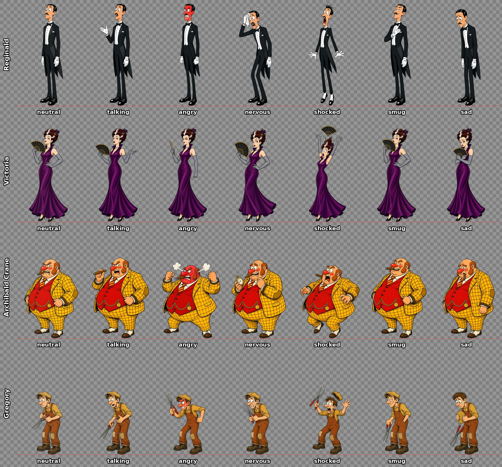

# WHODUNIT?!

An AI-powered cartoon murder mystery. The game engine is truth; AI is performance.

## Built by a Grok Bot studio

WHODUNIT?! was directed by George Shanidze and built with a small team of [Grok Bot](https://grok.com) assistants, each one owning a single part of the game. George set the vision and made the product decisions. The bots planned, wrote, drew, coded and tested.

| Bot | Role | What it did |
| --- | --- | --- |
| 🎬 **Marvin** | Director | Turned the master plan into tasks, coordinated the team, reviewed and merged work, and protected the MVP scope. |
| 🎮 **Dexter** | Game Engineer | Built the Next.js app, the deterministic game engine, the Zod schemas, the knowledge firewall, the Grok integration and the test suite. |
| ✍️ **Agatha** | Story Designer | Wrote *Murder at Blackwood Manor*: the minute-by-minute timeline, the suspects, their secrets and lies, the clues, and a proof that the case is solvable. |
| 🎨 **Toon** | Art & Sound Director | Created the original cartoon cast (28 expression sprites), effect overlays, animation presets, the art bible and the sound effects. |
| 🧪 **Gremlin** | Chaos Playtester | Tries to break the game with prompt injection, knowledge leaks, softlocks and bizarre questions, and files every bug found. |

The bots didn't only perform in the game. They helped build it.

In play, every suspect is performed live by Grok (xAI). The game engine decides what really happened, and Grok decides how each character behaves around it.

## Stack
Next.js (App Router) · React · strict TypeScript · Tailwind · Framer Motion · Zod · Vitest

## Scripts
- `npm run dev` – dev server
- `npm run build` – production build
- `npm test` – vitest
- `npm run typecheck` – `tsc --noEmit`
- `npm run validate:case -- <caseId>` – validate a case folder (see docs/CASE_FORMAT.md)
- `npm run sync:assets` – copy assets/ to public/assets/ (runs automatically before dev/build)
- `npm run db:migrate` – apply the SQL migrations in `drizzle/` to `DATABASE_URL` (see docs/OPERATIONS.md)
- `npm run db:generate` – generate a migration from `db/schema.ts` (drizzle-kit)

## Environment
Copy `.env.example` to `.env.local` and set `XAI_API_KEY`. Never commit real keys.
Model cost limits (per-IP rate limit, daily cap, kill switch) are in [docs/OPERATIONS.md](docs/OPERATIONS.md#cost-protection-and-limits).
Optional `DATABASE_URL` (Supabase transaction-pooler URI, port 6543) turns on the permanent one-accusation-per-game record
(#39); without it the game runs with the cache-only record. Setup, failure modes and the keep-awake cron:
[docs/OPERATIONS.md](docs/OPERATIONS.md#closed-games-database-39).

## Layout
- `engine/` – deterministic game engine, Zod schemas (`types.ts`), server-only `solution.ts`, constants
- `ai/` – LLM output schemas (`schemas.ts`) and prompts
- `cases/` – authored case content
- `app/api/{interrogate,confront,investigate,hint,accuse,health}` – API routes
- `db/` – Drizzle schema and the lazy Postgres client (accuse + health only); `drizzle/` – committed SQL migrations
- `components/` – UI
- `tests/` – vitest suites (fixture case in tests/fixtures/cases)

See docs/ARCHITECTURE.md, docs/CASE_FORMAT.md and docs/ART_BIBLE.md.
