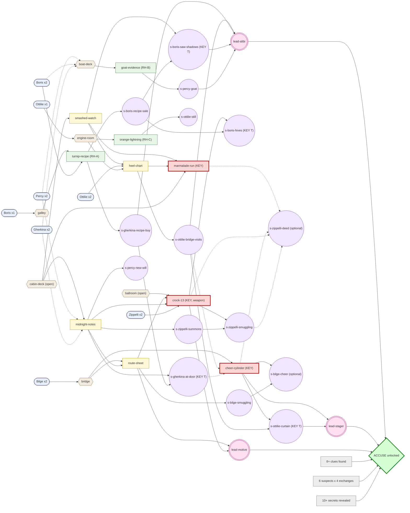

# Case 002 · Murder Cruise on the S.S. Tallyho: Design Document

| | |
|---|---|
| **Case id** | `tallyho` |
| **Author** | Agatha (mystery and narrative design) |
| **Status** | Design only. No JSON, no art. A later build turns this into `cases/tallyho/*` mechanically. Brought in line with `docs/CASE_TWO_IMPLEMENTATION_PLAN.md` (PR #34): the 1936 setting and era vocabulary (1.5), the purser (1.6), the helper picker and strict roles (4.7), real order landmarks (3.6), and section 11 brought up to date. |
| **Branch** | `agatha/case-tallyho-design` |
| **Depends on** | The progression model (`requires`/`lockedLine`, `leads`, `accuseGate`, key testimony). **It is built and on `main`** (Dexter's backend, commits 5831a5e to 4709822; Blackwood migrated in #36), and every Tallyho condition uses only the five shipped `Condition` atoms (plan 3.7). The two-culprit accusation (G1), the `setting` block and per-case `orderLandmarks` are decided in the plan but not built yet. |
| **Engine note** | `engine/` is untouched. Section 11 lists everything the engine cannot express today, with the smallest proposed change for each. |

---

# 0. Pitch summary (for George)

> **This page is spoiler-free.** Everything after the "SPOILERS BELOW" marker gives away the answer.

**Murder Cruise on the S.S. Tallyho** is a cartoon whodunit in a thunderstorm. Commodore Barnabas "Barnacle" Brine, the Marmalade King, throws his Last Tally-Ho Gala aboard his steam yacht. He means to make a Midnight Announcement that will wreck at least five people's lives. At 22:38 the whole ship hears him bellow his famous cheer, "TALLY-HO! SPREAD THE BRINE!". At 22:55 his niece finds him in his stateroom, bonked on the head with something heavy that has vanished, his orange toupee gone, marmalade everywhere and his pocket-watch smashed at 22:41. No doctor aboard, the wireless dead in the storm, and no police until the ship makes port at dawn.

**The cast (six suspects, all funny, all lying about something):**

- **Captain Horatio Bilge.** Never wrong, only "alters course". Secretly seasick.
- **Amadeo "The Great Zippelli".** Escape artist, speaks about himself in the third person, allergic to oranges on a marmalade yacht.
- **Dame Gherkina Piccalilli-Pratt.** The Pickle Queen. Every sentence is a pun about vinegar.
- **Persimmon "Percy" Brine.** The sweet, scatterbrained niece and heir. Sneaks carrots into her reticule.
- **Chef Boris Buttercrumb.** A huge, weepy giant who cries into the soufflé.
- **Chief Engineer Ottilie Wrenchley.** Talks to the boiler, trusts only machines.

**Why this is Death-on-the-Nile difficulty, not Blackwood difficulty:**

- **A bigger cast and six public motives.** The will, the pickle war, the recipe, the scrap yard, an old grudge and "the cargo". Every suspect has a juicy one.
- **An alibi that looks airtight.** The Commodore is "alive" at 22:38 and "dead" at 22:41, and almost everyone is accounted for in that window. The player's first instinct will be to chase the three people who are not.
- **Three red-herring subplots** (a recipe swindle, a goat in a lifeboat, a bootleg still), each with its own funny little resolution.
- **A time of death that cannot be taken at face value**, and a proof that has to be earned with evidence, not a confession.
- **Two culprits who each did half the job** (a new multi-culprit accusation, see section 11).
- **Visual pay-offs.** The BONK lands, the sticky clues tell tales, and one very silly object ends up in a very wrong place.

**Length.** The fastest legal win is **32 actions** (Blackwood, now built on the same progression model: 10, as the validator prints). A typical game is **45 to 70**. Winning needs three key clues and two revealed testimonies, so it cannot be done on a lucky guess or a confession.

**Size against the brief:**

| Item | Target | This design | Note |
|---|---|---|---|
| Suspects | 6 | 6 | |
| Locations | 6 | 6 | |
| Clues | 9 to 10 | 10 | 3 are red-herring clues, 3 are key evidence |
| Secrets | about 14 | 15 | One extra: the culprit's "deed" confession, which is optional flavour and unreachable without heavy stress |
| Lies | 10 to 12 | 12 | |
| Red-herring subplots | 2 to 3 | 3 | Plus one half-subplot (Dame Gherkina at the door) that the same clues resolve |

**What I need from you (spoiler-safe):**

1. ~~**Two-culprit grading.**~~ **Decided: strict roles** (plan Q1). The accuse form always asks "Did anyone help?" with an explicit "No one helped" (plan Q2). Section 4.7.
2. ~~**The progression engine.**~~ **Done: progression is built and on `main`.** Section 11.
3. **Length.** Is a 32-action floor right for you, or do you want a lower or higher floor?

**What I need from the build:** one new field for the second culprit, one new reveal trigger, a few small validator tweaks. Section 11 has the full list.

---

# ⛔ SPOILERS BELOW ⛔

**Everything under this line gives away the solution. Do not feed this file to the LLM or ship it to the client.**

## 0.1 The twist in one paragraph

**Captain Bilge** and **The Great Zippelli** run a smuggling racket (gold sovereigns in false-bottomed Brine crocks and in Zippelli's trunk). The Commodore found out. Zippelli bonked him with the heavy **Crock 13** at **21:52**, then staged a smashed watch for **22:41**. At **22:38**, while Zippelli was chained into a sealed glass chest in front of the whole saloon and the Captain was "on the bridge with the Chief Engineer", the Captain slipped behind the chartroom curtain and played a **recorded cheer** over the ship's Voice-Horns. So the "airtight alibis" cover the wrong window. The real time of death is 21:52, and the player can prove it because **the ship changed its list at 22:14**: the marmalade spilled while she leaned one way, but the watch, the sea chest and the smear slid the other way. The sea testifies that the Commodore was dead before the Great Lurch.

- **Doer:** Zippelli (deed, watch, weapon).
- **Stager:** Bilge (the voice at 22:38 and the bridge alibi).
- **Neither could have done it alone.** Zippelli was under glass at 22:38. Bilge was on the bridge with a witness at 21:52.

---

## 1. Premise, setting, cast

### 1.1 Premise and setting

It is **a summer night in 1936 in the Bay of Bother**, and the private steam yacht **S.S. Tallyho** is wallowing in a thunderstorm during the Commodore's Last Tally-Ho Gala. The Marmalade King, **Commodore Barnabas "Barnacle" Brine** (Brine's Bitter Orange: "Spread the Brine!"), has invited his niece, his rival, his chef, his captain, his engineer and a headlining magician, and has promised a **Midnight Announcement** that nobody is allowed to know about. His orange toupee, his brass trumpet and his booming cheer, "TALLY-HO! SPREAD THE BRINE!", are the stuff of legend. At 22:55 his niece finds him dead in the Owner's Stateroom, bonked on the head with something heavy and round that is nowhere to be seen, the room awash in sticky marmalade, his pocket-watch smashed at 22:41. The squall knocked out the wireless, there is no doctor aboard, and the next port is hours away. Nobody leaves. There are **no police aboard**: until the Tallyho makes port at dawn, the in-world authority is the ship's purser (1.6), a neutral officer who is not a suspect. The detective is a guest on board, and is always called "detective". Six people had a reason to want the Commodore quiet. Everybody is lying about something.

**World details that carry the plot (all fair, all introduced early):**

- **The Voice-Horn network.** Brass horns in the Grand Saloon, the cabin-deck corridor, the galley and the bridge wing. The Commodore speaks into a trumpet in his stateroom; the Captain's chartroom holds the junction box that feeds the horns, and the Cheer-Box.
- **The Plunge.** At 22:17 the headliner Zippelli is chained into a glass chest by a volunteer (Dame Gherkina seals it with her pickle-jar wax signet) and lowered into a tank-stage. At 22:38 the band drum-rolls, a rubber shark is lowered and the Commodore bellows his cheer over the horns. At 22:49 Zippelli bursts out.
- **The list.** The ship leans one way or the other. A squall at 21:40 makes her heel to starboard. At 22:14 a rogue wave and the Captain's "hard-a-port" flip her to a port list. Everything loose then slides to port.
- **Offstage extras.** About forty Gala guests fill the saloon, the helmsman stands on the bridge, a footman and the stewards wait at table, the kitchen boys are seasick in the scullery, and the **purser** keeps his office forward on the main deck (1.6). None of them is a character, none is a witness to anything that matters, and none can be interrogated. The "saloon" alibis rely on named suspects only (Percy and Dame Gherkina).

### 1.2 The victim

**Commodore Barnabas "Barnacle" Brine** (`commodore-brine`). Aliases: "the Commodore", "Barnacle", "Barnabas", "Uncle Barnabas", "the Marmalade King", "the Old Man". He wears an orange toupee, bellows through brass trumpets and treats every room as a stage. He is found at 22:55 (`foundAt` 22:55, `foundAtLocationId` `cabin-deck`).

### 1.3 Cast table

| Suspect (`id`) | Role | Comic hook | Public persona | Motive(s) |
|---|---|---|---|---|
| **Captain Horatio Bilge** (`bilge`) | Captain of the Tallyho | He is never wrong, only "alters course". Secretly seasick; keeps a bucket in the chartroom. Speaks in nautical euphemism ("a gentle reconsideration of the compass"). | Stern, upright, gold-braided pillar of the ship. | *Apparent:* the Commodore means to **scrap the Tallyho** and end his command (`f-tallyho-scrap`). *Real:* the Commodore found out about the smuggling and meant to expose him at 23:30. **Culprit (stager).** |
| **Amadeo "The Great Zippelli"** (`zippelli`) | Escape artist, Gala headliner | Talks about himself in the third person. Famously allergic to oranges, which is awkward on a marmalade yacht. "Nothing up my sleeve! (Much.)" | Dazzling, pompous, harmless showman. | *Apparent:* **spite**: the Commodore halved his fee and re-billed him as "THE BRINE DIP" (`f-zippelli-fee`). *Real:* the same smuggling; Crock 13 exposed the false bottom he had built. **Culprit (doer).** |
| **Dame Gherkina Piccalilli-Pratt** (`gherkina`) | The Pickle Queen, rival tycoon | Every sentence is a vinegar pun. Wears a hat shaped like a pickle jar. Carries a "cheque book of doom". | Steely, grand, gracious in public, ruthless in private. | **The pickle war / takeover.** Her £2,000,000 offer was refused in rhyme (`f-pickle-offer`) and the Commodore meant to launch Brine's Pickled Onions to ruin her. Innocent. |
| **Persimmon "Percy" Brine** (`percy`) | Niece and heir | Sweet, breathless, scatterbrained; carrots in her reticule; hides a goat. | The darling niece who "wouldn't hurt a fly". | **The will.** The new will cuts her off completely (`f-new-will`) and she is the obvious heir (`f-percy-heir`). Innocent. |
| **Chef Boris Buttercrumb** (`boris`) | Ship's chef | Huge, weepy, cries into the soufflé; speaks entirely in food metaphors. | Gentle giant who "couldn't kill a lobster without an apology". | **The recipe.** The "secret bitter-orange recipe" is nine parts turnip (`f-recipe-turnips`), the Commodore has threatened to sack him three times (`f-boris-sack`) and means to blame him publicly. Innocent. |
| **Chief Engineer Ottilie Wrenchley** (`ottilie`) | Chief Engineer | Talks to the boiler ("Gladys") and trusts only machines. Deadpan. | Grease-streaked, blunt, absolutely loyal to the ship. | **The scrap yard.** If the Tallyho is scrapped the whole crew is paid off (`f-tallyho-scrap`). Innocent. |

**Aliases (for the `aliases` field; no collisions):**

| Id | Aliases |
|---|---|
| `bilge` | "the Captain", "Captain Bilge", "Horatio", "the skipper", "Cap'n" |
| `zippelli` | "Zippelli", "the Great Zippelli", "Amadeo", "the magician", "the maestro", "the escape artist" |
| `gherkina` | "Dame Gherkina", "Gherkina", "the Pickle Queen", "Madam Pratt", "Piccalilli-Pratt", "Dame Pratt" |
| `percy` | "Percy", "Persimmon", "Miss Brine", "the niece" |
| `boris` | "Boris", "Chef", "the cook", "Buttercrumb", "Chef Buttercrumb" |
| `ottilie` | "Ottilie", "the Chief", "the Chief Engineer", "Miss Wrenchley", "Wrenchley" |
| `commodore-brine` | "the Commodore", "Barnacle", "Barnabas", "Uncle Barnabas", "the Marmalade King", "the Old Man" |

*Collision rules:* nobody has the bare alias "Brine" (the victim and Percy share the surname), nobody but the victim has "the Old Man" (Bilge uses it for the Commodore; if Bilge were also "the old man" the LLM would confuse them), and "the Chief" means Ottilie only.

### 1.4 Cartoon-physics rules (the absurd logic that stays consistent)

The tone is Looney Tunes, but the rules never change mid-case. These are also the fair-play anchors:

1. **The Rule of the Slide.** Anything loose slides downhill, and downhill is whichever way the ship is leaning. (Starboard list 21:40 to 22:14, port list 22:14 onwards.)
2. **The Rule of Sticky.** Marmalade sticks to everything it touches and records where it went. It never dries.
3. **The Rule of the Voice.** Every Voice-Horn plays what the junction box sends it. The Commodore's stateroom mouth-trumpet is silent if he is not speaking into it.
4. **The Rule of the Bonk.** A stoneware crock to the skull makes exactly one hollow BONK, like a church bell hit with a pudding. It carries across the boat deck.
5. **The Rule of the Allergy.** Zippelli's allergy is real. One touch of marmalade means hives, sneezing and a rash within five minutes.
6. **The Rule of the Seal.** Dame Gherkina's pickle-jar wax signet is unforgeable and unbroken. The chest was never opened.
7. **The Rule of the Captain.** Bilge is never wrong. He only alters course. Nothing he says in the early game is ever a plain "I was wrong".


### 1.5 Era and vocabulary (decided: plan Q6)

**The summer of 1936, aboard a private steam yacht at sea in a storm.** This replaces Blackwood's hard-coded "English country house in the 1920s" with a per-case `setting` block (plan 4.4). The player stays **"detective"** everywhere; there is no field for it.

```json
"setting": {
  "place": "aboard a private steam yacht at sea in a storm",
  "decade": "the 1930s",
  "dateLine": "the summer of 1936",
  "site": "the ship",
  "authority": {
    "noun": "the purser",
    "policeAboard": false,
    "note": "the police take over when we make port"
  },
  "roster": "Others aboard:",
  "vocabulary": {
    "allowed": [
      "disc",
      "gramophone",
      "wireless",
      "telegraph",
      "galley",
      "purser"
    ],
    "banned": [
      "phones",
      "apps"
    ]
  }
}
```

- **Allowed words** (`vocabulary.allowed`, named in the era prompt as ordinary for this world, and exempt from every banned list): **disc, gramophone, wireless, telegraph, galley, purser.** Blackwood's "the telephone is not modern" sentence does not apply here.
- **Banned words** (`vocabulary.banned`, added to the default anachronism list; whole words, case-insensitive, plural-aware): **phones, apps.** "phones" bans *phone* and *phones*, but not *gramophone* or *telephone*. The always-banned meta words (emoji, AI, JSON, "okay" and so on) still apply.
- **Period words used in this design that need no exemption:** Voice-Horn, voice-pipe, Cheer-Box, wax cylinder, heel recorder, engine-room telegraph, cheque book, lugger, sovereigns.
- **Authoring rules for the build:**
  - The ship talks over the Voice-Horns and the voice-pipe, never a "phone". This document used to say "house-phone" at 21:09; it now says the Captain **calls down the voice-pipe to the greenroom** (3.3, A.2 `ev-plan-call`).
  - Say "wireless", not "radio".
  - No authored string (bio, secret, lie, fact, `lockedLine`, ending) may contain a banned word. Validator V26 checks this.

### 1.6 The purser: the in-world authority (decided: plan Q6)

**Mr Ambrose Quill, the purser.** He is the owner's officer: he keeps the ship's log, the passenger list, the Gala cash and the passengers' valuables. He is **neutral, offstage and never a suspect**. He is not a character file, not a witness and not someone the player can question.

**Why the purser, and not the Captain or the police:**
- Captain Bilge is a suspect, so he cannot be the authority.
- "The constable" does not exist at sea, and there are **no police aboard until port**.
- So the Captain keeps the ship, and the purser keeps the inquiry.

**Engine lines that read `setting.authority`** (plan 4.4), drafted:
- `CASE_CLOSED_LINE`: *"The purser has everyone's statements, and the police take over when we make port."*
- `CASE_CLOSED_SEARCH_LINE`: *"The purser has sealed the ship."*

**His timeline.** He is never at any of the six locations before 23:08, so he is in no checkpoint row of 3.4.

| Time | Where | What |
|---|---|---|
| 19:30 to 23:04 | Purser's office, forward on the main deck (not a game location) | Doing the Gala accounts with the cash box and the valuables safe, door shut against the weather. From 21:40 storm discipline keeps him at this post: his storm station is the safe. There is no Voice-Horn in his office (1.1 lists every horn). |
| 23:04 | Office | A steward brings word of the body. |
| 23:08 | Cabin deck | `ev-purser-takes-charge` (A.2). He arrives with the ship's log, seals the stateroom, says the wireless is dead and the police take over at port, and asks the detective, a guest aboard, to find out what happened. Travel from the office to the cabin deck: 4 minutes. |

**Knowledge boundaries** (in case a later build gives him lines, e.g. in an ending):

| He knows | He does not know, and must never say |
|---|---|
| The passenger list and who has which cabin. | Anything seen or heard anywhere between 19:30 and 23:04. He was alone in his office behind a shut door. |
| The printed programme (`f-plunge-programme`) and the cheer tradition (`f-cheer-tradition`). | The cheer at 22:38: his office has no horn. He can neither confirm nor deny it. |
| That the wireless died in the squall, that there is no doctor (`f-no-doctor`), and that the police take over at port. | The BONK, the Great Lurch's effect on the stateroom, or anyone's movements. |
| That the Commodore asked him to bring the ship's log to the saloon at midnight. | What The Announcement was. He witnesses nothing at midnight because the Commodore is dead. He does not know about the new will (`f-new-will`). |
| | The cargo or the crocks. By the Commodore's standing order, the Captain's private stores never pass through the purser's books, so he cannot testify to crock 13 or the route (`f-route-dawn`). |
| | The chartroom, the Cheer-Box, the course, the goat, the still, or the recipe sale. |

**Alibi and timeline check** (done by hand against 3.3, 3.4 and section 12):
- He is in no located entry before 23:08, so the presence check (12 #3) is unchanged.
- His office is on no movement route used in 3.2, so he crosses nobody, and no travel time changes.
- He hears neither the BONK nor the cheer, so the true-time and staged-time alibi tables (12 #10) are unchanged.
- He knows nothing about crock 13, so he cannot break any lie early. No lie or secret lists him.
- The grid stays 23 checkpoints x 7 rows.
- `ev-household-gathers` (23:05) does not involve him: he arrives at 23:08, after it.
- **He is not a suspect, and it is not a gap that he has no alibi.** He is never in `characters`, he never appears in `motives`, and V32 rejects an authority noun that matches a suspect's name, alias or role.
- His new entry `ev-purser-takes-charge` matches no order landmark's fact pattern (checked with 3.6).

---

## 2. Locations

Six locations. Two are open from the start (cabin deck, ballroom); four are gated. Each search returns every clue at that location whose `requires` is met, and a search that cannot yet reveal something returns that clue's `lockedLine` (a nudge toward the unlock, never the answer). Gate conditions use the proposal's `Condition` shape; "×n" means `interrogated: {characterId, minExchanges: n}`, and one exchange is one accepted interrogation turn (a presented clue or testimony counts).

| Location (`id`) | Name and look | Opens | Locked line (draft) | Searchable (clue ids) |
|---|---|---|---|---|
| `cabin-deck` | **The Cabin Deck.** A narrow mahogany corridor with brass-numbered doors and a Voice-Horn in the ceiling. At the end, the **Owner's Stateroom** (crime scene): desk, brass-bound sea chest, a porthole under the starboard lifeboats, and a marmalade-sodden carpet. | Open | none | `smashed-watch` (open), `midnight-notes` (needs Percy ×2 **or** Gherkina ×2), `marmalade-run` (needs `smashed-watch` **and** `heel-chart`) |
| `ballroom` | **The Grand Saloon.** The Gala is in full swing: band, buffet, sloshing tank-stage with the glass chest, and a greenroom behind it with **Zippelli's prop trunk** in the wings. A Voice-Horn hangs over the bandstand. | Open | none | `crock-13` (needs `route-sheet` **and** `midnight-notes` found, **and** Zippelli ×2) |
| `bridge` | **The Bridge and Chartroom.** Brass wheel, telegraph, a helmsman gripping the spokes. Behind a velvet curtain, the Captain's **chartroom**: chart table, the junction box, a bucket and the Cheer-Box. | Bilge ×2 | *The helmsman blocks the hatch with a mop. "Captain's orders, detective. Nobody on my bridge until you've had a proper word with him."* | `route-sheet` (needs `midnight-notes` found), `cheer-cylinder` (needs revealed `s-ottilie-bridge-visits` **or** `s-gherkina-at-door`) |
| `galley` | **The Galley.** A steaming brass-and-copper kitchen. Crates of numbered crocks, a rack of knives and a weeping giant. A Voice-Horn dangles over the stove. | Boris ×1 | *A cleaver quivers in the door frame. A tearful voice: "Ask first. Search after."* | `turnip-recipe` (needs Boris ×2) |
| `engine-room` | **The Engine Room.** A roaring boiler named Gladys, a wall of dials, a heel recorder chart and, behind a hatch, the bilge pump house. The air smells of hot oil and, faintly, burnt breakfast. | Ottilie ×1 | *The hatch is bolted. A hand-painted sign: "NO ENTRY WITHOUT A WORD TO OTTILIE. THE SPANNER IS NOT A JOKE."* | `heel-chart` (needs `smashed-watch` found **and** Ottilie ×2), `orange-lightning` (needs the engine room searched once) |
| `boat-deck` | **The Boat Deck.** Wind, spray, creaking lifeboats on davits. The rail overlooks the Owner's Stateroom porthole. In lifeboat 3, something bleats. | Lead `lead-boat-deck` (see 8.1; it opens when Percy ×2, Boris ×2 **or** Gherkina ×2) | *The storm hatch is dogged shut. There is no good reason to go up there yet. Somebody on this ship has one.* | `goat-evidence` (open on arrival) |

**Search flavour (drafts):**

- `cabin-deck`, first search with nothing new: *"The marmalade is up to your ankles and has opinions."*
- `ballroom`, first search: *"The buffet, the band, the trunk. The trunk is locked with seventeen padlocks and a rabbit. Nothing to find here yet."* (Becomes `crock-13` once unlocked.)
- `engine-room`, first search: after `heel-chart`, *"A hatch behind the boiler. A smell like a burnt breakfast." opens `lead-smell`*.

**Locked lines for clues (nudges):**

| Clue | Locked line (draft) |
|---|---|
| `midnight-notes` | *The desk has a speech-shaped hole. The Commodore never left notes lying around; he hid them where his niece or his rival would know to look. Ask someone who knew his habits.* |
| `marmalade-run` | *Marmalade everywhere, and it plainly has something to say. You cannot read it yet. You need to know which way "downhill" pointed at ten to ten.* |
| `heel-chart` | *The chart is under glass and under Ottilie's glare. "Come back when you know what you're asking. And when we've talked properly."* |
| `route-sheet` | *A chart table full of charts. None of them looks strange. You need a reason to hunt for a particular one.* |
| `cheer-cylinder` | *A curtained alcove with a brass box and a bucket. The Captain's glare says it is none of your business. You need a reason to open that box.* |
| `crock-13` | *Seventeen padlocks and a rabbit. Searching without cause would earn you a lawsuit and a bite.* |
| `turnip-recipe` | *The recipe drawers are guarded by a weeping giant: "Not until you understand my pain."* |
| `orange-lightning` | *A bolted hatch behind the boiler, and a smell like a burnt breakfast. You will need a second look, and a reason.* |

---

## 3. Timeline

### 3.1 Clock, storm and the Great Lurch

- **`dayStartsAt`: `"18:00"`.** The whole story lies between 19:30 and 23:10. The detective takes the case at 23:10.
- **21:40, the squall.** A thunderstorm closes in. Lightning knocks out the wireless and the ship heels to starboard (6 degrees, later 8). From here on, **loose objects slide to starboard** (Rule of the Slide).
- **22:14, the Great Lurch.** A rogue wave hits the Tallyho on the port quarter; the Captain orders hard-a-port, and she swings from a starboard to a **port list (6 degrees)** for the rest of the night. Everything loose slides to **port**: in the saloon the band, the buffet and Dame Gherkina's hat; in the Stateroom the sea chest, the smashed watch, the marmalade smear. Ottilie's heel recorder logs the flip to the minute.
- **How the storm creates alibi pressure.** Storm discipline keeps everybody at a post or in the saloon, so almost everyone has a plausible alibi for the window the Captain and the watch *invented*. At the same time, the list is the **unforeseen flaw** in the staging. Zippelli staged the watch while the room leaned starboard; twenty-two minutes later the sea turned the room over and moved the evidence to the wrong side of the room.
- **Why no medical time of death.** There is no doctor (`f-no-doctor`). The porthole leaks and the stateroom is cold, so body temperature is useless and no character is qualified to say. The only "time of death" the game has is the watch and the cheer.

### 3.2 Travel times (minutes)

Used for every movement below, and checked by script (section 12).

| From and to | Time | Note |
|---|---|---|
| Ballroom to cabin deck | 2 (grand stair), 3 (service stair) | Zippelli always uses the service stair so as not to be seen. |
| Ballroom to galley | 1 | |
| Ballroom to boat deck | 3 | |
| Ballroom to bridge | 3 | |
| Cabin deck to boat deck | 2 | |
| Cabin deck to bridge | 3 | |
| Galley to boat deck | 4 | |
| Galley to engine room | 3 | |
| Engine room to bridge | 4 | |
| Engine room to ballroom | 4 | |
| Boat deck to bridge | 1 | |

### 3.3 True timeline (what really happened)

Times marked **(P)** are perception entries: what a character personally saw or heard, authored as its own entry at the perceiver's location (the Blackwood convention). The full registry with ids, sources, confidences and who-knows-what is in **Appendix A**.

| Time | Where | What really happens |
|---|---|---|
| 19:30 | Saloon | The Captain's Dinner begins. The Commodore opens it with a live cheer at **19:31**: *"TALLY-HO! SPREAD THE BRINE, ME HEARTIES, AND MIND THE PICKLES, PRATT!"* (no hiccup; the live cheer never hiccups). |
| 20:20 | Galley | The Commodore pops into the galley to praise the baked Alaska, hefts **crock 13**, finds it far too heavy for marmalade, tucks it under his arm and asks Boris who packed it. Boris: "The crates come up from the Captain's stores." |
| 20:45 | Saloon | A footman presses a card into Zippelli's hand: *"A quarter to ten, my stateroom. The fee, and another matter. B.B."* |
| 20:50 | Saloon to bridge | Bilge slips out of the dinner ("storm warnings"); on the bridge from 20:53. |
| 20:55 to 21:11 | Saloon, bridge | The Commodore follows. On the bridge (20:58 to 21:08) he tells Bilge he will **scrap the Tallyho**, and that they will "talk about crock 13 after the show". He is back in the saloon by 21:11. |
| 21:09 | Bridge | Bilge calls down the voice-pipe to the greenroom and asks Zippelli to "come up and discuss the Plunge". |
| 21:12 to 21:21 | Saloon, bridge | Zippelli goes to the bridge (arrives 21:15). **In the chartroom, 21:15 to 21:18, the pair settle the plan:** Zippelli will silence the Commodore at his 21:45 summons and set the Commodore's watch to **22:41**; at **22:38**, while Zippelli is chained in the glass chest and the Captain is on the bridge, the Captain will play the Cheer-Box. Zippelli is back in the saloon at 21:21. |
| 21:33 to 21:35 | Saloon to cabin deck | The Commodore retires "to polish the Speech", announcing he is not to be disturbed, and hangs his **ENTER AT PERIL** sign (21:35). |
| 21:35 to 21:40 | Cabin deck, boat deck | Percy leaves the saloon, passes the stateroom at **21:37** (hears her uncle humming "Tally-Ho" inside) **(P)**, reaches her cabin, grabs carrots, and heads for the boat deck, arriving at **21:40** (the goat, Duchess, lives in lifeboat 3). |
| 21:40 | Everywhere | **The squall.** The ship heels to starboard. The wireless dies. Zippelli leaves the greenroom by the service stair. |
| 21:43 to 21:45 | Cabin deck | Zippelli arrives at 21:43; the Commodore admits him at **21:45**. |
| 21:45 | Engine room | Ottilie leaves the engine room with her list readings, to report to the Captain. On the bridge at 21:49. |
| 21:46 | Saloon, galley | Dame Gherkina and Boris each leave for a secret appointment on the boat deck (Gherkina arrives 21:49, Boris 21:50). |
| 21:45 to 21:51 | Stateroom | **The confrontation.** The Commodore shows Zippelli the opened crock 13 (sovereigns under the marmalade) and swears to expose him and "your Captain friend" at midnight. A tasting jar sits on the desk. |
| 21:49 to 21:56 | Bridge | Ottilie reports the list to the Captain; he stands beside her the whole time **(P by both)**. |
| 21:50 | Boat deck | Boris sells Dame Gherkina the Commodore's turnip recipe card for £500, counted out on the starboard rail. |
| **21:52** | **Stateroom** | **THE MURDER.** Zippelli seizes the crock and BONKS the Commodore. The tasting jar smashes; marmalade runs toward the starboard wall under the 7-degree list. |
| 21:52 | Boat deck | From the starboard rail Boris sees two shadows on the porthole curtain: a **tall thin one with windmilling arms swings something round** at a **small round one with a pointy swirl of hair on top** (the Commodore's soft-serve toupee). BONK **(P)**. Dame Gherkina hears the hollow BONK and checks her diamond wristwatch: 21:52 **(P)**. Percy, in the lifeboat, hears a distant gong **(P)**. |
| 21:54 | Stateroom | Zippelli pulls the watch from the Commodore's pocket, **pulls the crown out**, sets it to **22:41**, stamps the glass flat, drops it in the marmalade by the starboard wall. He takes the crock and wraps it in his cape. |
| 21:55 | Boat deck | Percy creeps out for hay and finds Boris and Dame Gherkina counting banknotes by the rail. All three see each other **(P)**. |
| 21:56 | Stateroom, bridge, boat deck | Zippelli leaves with the crock and re-hangs the ENTER AT PERIL sign. Ottilie leaves the bridge. Boris leaves the boat deck. |
| 21:59 | Saloon | Zippelli slips into the greenroom and hides the crock in the trunk's false wall. |
| 22:00 | Galley, engine room | Boris is back in the galley. Ottilie is back at Gladys. |
| 22:03 | Greenroom | Boris delivers Zippelli's pre-show omelette. Zippelli is **sneezing, blotched with hives, sticky to the elbows**, rinsing his hands in a finger bowl and blaming spirit gum. Boris sees all of it **(P)** and leaves at 22:05. |
| 22:05 to 22:10 | Boat deck, saloon | Dame Gherkina leaves the boat deck (saloon at 22:08, hat askew, hay on her shoulder). Percy leaves at 22:07 (saloon at 22:10). |
| **22:14** | Everywhere | **THE GREAT LURCH.** The list flips from starboard to **port**. In the saloon everything slides to port **(P)**. In the engine room the heel recorder swings from 8 degrees starboard to 6 degrees port and Ottilie pencils "LURCH 22:14" **(P)**. **In the stateroom, with nobody there but the body,** the sea chest slides from the starboard wall across the marmalade and parks on the Commodore's coat-tail, and the smashed watch slides through the marmalade into the **port** corner. |
| 22:15 to 22:17 | Saloon | Dame Gherkina chains Zippelli into the glass chest and presses her pickle-jar seal into hot wax on the lid. **The Plunge begins at 22:17.** |
| 22:17 to 22:49 | Saloon | Zippelli sits sealed in the glass chest under the spotlights, in full view of the saloon (**Percy and about forty guests**). |
| 22:28 | Saloon | Dame Gherkina slips out "to powder her nose". Cabin deck at 22:30. |
| 22:30 | Engine room | A bearing runs hot. Ottilie leaves to report; on the bridge at 22:34. |
| 22:32 to 22:41 | Cabin deck | Dame Gherkina knocks on the stateroom door (the Commodore had invited her for half past ten; she is going to say her offer stands), shouts, and presses her ear to the wood. No answer. |
| 22:36 | Bridge | The Captain says he must "check the chart", draws the chartroom curtain and vanishes behind it. Ottilie waits at the telegraph. |
| **22:38** | **Everywhere** | **THE CHEER.** Behind the curtain: *click, hiss*. The ship's horns bellow *"TALLY-HO! (hic) SPREAD THE BRINE!"*. Saloon: Percy, Zippelli (inside the chest) and the guests hear it **(P)**. Galley: Boris hears it **(P)**. Bridge wing: Ottilie and Bilge hear it **(P)**. Corridor: Dame Gherkina hears it **(P)** and hears *nothing at all from behind the stateroom door*. The Commodore, of course, is lying dead on the carpet. The Captain has just started the Cheer-Box. |
| 22:40 | Bridge | The Captain steps out, wiping his hands: "The Old Man's in fine voice tonight." **(P)** |
| 22:41 | Cabin deck, bridge | Dame Gherkina gives up and leaves the door. Ottilie leaves the bridge. The **watch's staged time**. |
| 22:43 to 22:45 | Saloon, engine room | Dame Gherkina is back in the saloon (22:43), takes a front seat. Ottilie is back at Gladys (22:45). |
| 22:49 | Saloon | Zippelli bursts out of the chest to thunderous applause. Dame Gherkina confirms that her wax seal was intact the whole time. |
| 22:52 to 22:55 | Cabin deck | Percy leaves the saloon, worried by the hush, and arrives at 22:54. At **22:55** she ignores the sign, opens the door, finds the body: marmalade everywhere, the toupee missing, the sea chest on her uncle's coat-tail and the watch smashed at 22:41. She screams **(P)**. |
| 22:58 to 23:05 | Cabin deck | The Captain leaves the bridge (22:58) and arrives at 23:01. Everyone else arrives by 23:05. The Captain reads the watch aloud and says: "Alive at 22:38, dead by 22:41." |
| 23:08 | Cabin deck | The purser arrives from his office (1.6), seals the stateroom and asks the detective to find out what happened. |
| 23:10 | Cabin deck | The detective takes over. |

**What the ship believes at 23:10 (the "official" story):**

- The Commodore cheered at **22:38** and was found dead at **22:55**. The watch says **22:41**. Death in a three-minute window.
- In that window **Zippelli** is under glass, **Bilge** is on the bridge (and says so, "the Chief Engineer was beside me"), and **Percy** is in the saloon. That leaves **Dame Gherkina** (in the corridor), **Boris** (alone in the galley) and **Ottilie** (who falsely claims to have been at her engine; she was actually on the bridge, which is exactly why her lie is suspicious) as the apparent suspects.
- The alibis feel airtight for three of the six. They are airtight for the wrong minute.

### 3.4 Location grid (checkpoint entries)

The case needs exactly one `loc-<char>-<HHMM>` point entry per suspect per checkpoint (the Blackwood convention), plus the Commodore's own rows for the body's whereabouts. 23 checkpoints, 6 suspects, none caught in transit.

Legend: **Sal** = Ballroom (Grand Saloon, greenroom, stage). **Cab** = Cabin deck. **Bri** = Bridge. **Gal** = Galley. **Eng** = Engine room. **Boat** = Boat deck.

| Time | Bilge | Zippelli | Gherkina | Percy | Boris | Ottilie | Commodore (then body) |
|---|---|---|---|---|---|---|---|
| 19:30 | Sal | Sal | Sal | Sal | Gal | Eng | Sal |
| 20:30 | Sal | Sal | Sal | Sal | Gal | Eng | Sal |
| 21:00 | Bri | Sal | Sal | Sal | Gal | Eng | Bri |
| 21:30 | Bri | Sal | Sal | Sal | Gal | Eng | Sal |
| 21:40 | Bri | Sal | Sal | Boat | Gal | Eng | Cab |
| 21:45 | Bri | Cab | Sal | Boat | Gal | Eng | Cab |
| 21:50 | Bri | Cab | Boat | Boat | Boat | Bri | Cab |
| 21:52 **(murder)** | Bri | Cab | Boat | Boat | Boat | Bri | Cab |
| 21:55 | Bri | Cab | Boat | Boat | Boat | Bri | Cab |
| 21:56 | Bri | Cab | Boat | Boat | Boat | Bri | Cab |
| 22:00 | Bri | Sal | Boat | Boat | Gal | Eng | Cab |
| 22:03 | Bri | Sal | Boat | Boat | Sal | Eng | Cab |
| 22:10 | Bri | Sal | Sal | Sal | Gal | Eng | Cab |
| 22:14 (Lurch) | Bri | Sal | Sal | Sal | Gal | Eng | Cab |
| 22:17 | Bri | Sal | Sal | Sal | Gal | Eng | Cab |
| 22:30 | Bri | Sal | Cab | Sal | Gal | Eng | Cab |
| 22:35 | Bri | Sal | Cab | Sal | Gal | Bri | Cab |
| 22:38 **(cheer)** | Bri | Sal | Cab | Sal | Gal | Bri | Cab |
| 22:41 (watch) | Bri | Sal | Cab | Sal | Gal | Bri | Cab |
| 22:45 | Bri | Sal | Sal | Sal | Gal | Eng | Cab |
| 22:49 | Bri | Sal | Sal | Sal | Gal | Eng | Cab |
| 22:55 | Bri | Sal | Sal | Cab | Gal | Eng | Cab |
| 23:05 | Cab | Cab | Cab | Cab | Cab | Cab | Cab |

*Checkpoint reading guide:* **21:52** is the murder minute: only Zippelli is on the cabin deck. **22:38** is the staged minute: Bilge and Ottilie on the bridge, Zippelli and Percy in the saloon, Dame Gherkina in the corridor, Boris in the galley.

### 3.5 Claimed timelines (what each suspect says, and how it differs)

| Suspect | Claim (condensed) | The truth | Lies |
|---|---|---|---|
| **Bilge** | "On my bridge from ten to nine till the screaming. The Chief Engineer stood by me at ten to ten and again at twenty-five to eleven. At 22:38 the Old Man cheered from his stateroom, same as every Gala. The straight course to Port Pottle, not a knot out." If pressed on 22:36 to 22:40: "A private matter of the stomach. Behind the curtain. Do not ask." | On the bridge throughout, which is the airtight half of the alibi. But the cheer was his recording, and he was not being sick. The course is not straight. | `l-bilge-owner-cheer`, `l-bilge-bucket`, `l-bilge-course` |
| **Zippelli** | "In his greenroom from half past nine to the Plunge, alone with his nerves. Last saw the Commodore alive at dinner (later: left him alive and cross at ten to ten). Heard him cheer at the shark from inside the chest, so he was alive while Zippelli was under glass." Allergy: "has not touched marmalade in ten years". Trunk: "ropes, silks and a rabbit named Mr. Biscuit." | Left the greenroom 21:40, in the stateroom 21:45 to 21:56, bonked him 21:52, back 21:59. | `l-zippelli-greenroom`, `l-zippelli-alive`, `l-zippelli-allergy`, `l-zippelli-trunk` |
| **Gherkina** | "In the saloon all evening, except twice to powder my nose. Cabin deck? Never. Barnabas and I had nothing left to say." | On the boat deck 21:49 to 22:05 buying the recipe card; in the cabin-deck corridor 22:30 to 22:41. | `l-gherkina-saloon`, `l-gherkina-door` |
| **Percy** | "In my cabin with a migraine from half past nine until the band struck up at a quarter past ten. Then the saloon. I went to say goodnight to Uncle at five to eleven." | A glimpse of the cabin deck at 21:37; the boat deck with the goat 21:40 to 22:07; the saloon from 22:10. | `l-percy-cabin` |
| **Boris** | "In my galley all night. The flambé doesn't flambé itself." | Galley, except the boat deck 21:50 to 21:56 and the greenroom at 22:03. | `l-boris-galley` |
| **Ottilie** | "I never left the engine room. Gladys won't babysit herself." | On the bridge 21:49 to 21:56 and again 22:34 to 22:41. | `l-ottilie-engine` |

### 3.6 Order landmarks (`orderLandmarks`, decided: plan Q6)

The order check (`ai/order-check.ts`) maps landmark phrases in a reply to the minute the **speaker's own visible knowledge** gives them (`landmarksOf`: the earliest matching fact wins), and rejects a reply that puts the speaker's own movement in the wrong window. Today it knows only Blackwood's five landmarks, so for Tallyho it is inert. The plan makes the landmarks per-case in `case.json`.

**Storm time, checked.** The plan's 21:40 for the storm agrees with this design everywhere:
- 1.1, the list;
- 1.4, Rule of the Slide;
- 3.1, the squall;
- 3.3, the 21:40 row;
- `f-list-history`;
- `ev-storm-squall`.

Nothing needed fixing. The thunderstorm rumbles all evening, but the landmark is **the squall at 21:40**, when the wireless dies and the ship heels to starboard. "Storm" on its own is not a pattern, because "in this storm" can mean any minute.

**The real patterns.** Each `say` and `fact` entry is one regex source, joined with `|`. `say` is compiled with `gi`, `fact` with `i`. There are no nested quantifiers and every source is under 160 characters, for the plan's safe-regex limits. `expectTime` is the validator pin (V13).

```json
"orderLandmarks": [
  {
    "id": "retires",
    "label": "the Commodore goes to polish his Speech",
    "say": [
      "\\b(?:went|gone|retired|left|went off|goes)\\s+(?:down\\s+)?to\\s+(?:polish|write|work on)\\s+(?:the|his)\\s+speech\\b",
      "\\bpolish(?:ing)?\\s+(?:the|his)\\s+speech\\b"
    ],
    "fact": [
      "\\bpolish the Speech\\b"
    ],
    "expectTime": "21:33"
  },
  {
    "id": "storm",
    "label": "the squall hits (the ship heels to starboard)",
    "say": [
      "\\bthe\\s+squall\\b",
      "\\b(?:squall|storm)\\s+(?:hit|struck|broke|came in|blew up)\\b",
      "\\bwhen\\s+it\\s+(?:broke|hit)\\b",
      "\\bheeled\\s+(?:over\\s+)?to\\s+starboard\\b",
      "\\bthe\\s+wireless\\s+(?:died|went|cut out)\\b"
    ],
    "fact": [
      "\\bsquall hits\\b"
    ],
    "expectTime": "21:40"
  },
  {
    "id": "bonk",
    "label": "the hollow BONK",
    "say": [
      "\\b(?:the|that|a)\\s+(?:hollow\\s+|distant\\s+)?bonk\\b",
      "\\b(?:the|that|a)\\s+(?:distant\\s+)?gong\\b"
    ],
    "fact": [
      "\\bBONK\\b"
    ],
    "expectTime": "21:52"
  },
  {
    "id": "wave",
    "label": "the Great Lurch (the big wave; the ship swings over to port)",
    "say": [
      "\\b(?:the\\s+)?great\\s+lurch\\b",
      "\\bthe\\s+lurch\\b",
      "\\bthe\\s+(?:big|rogue|great)\\s+wave\\b",
      "\\b(?:she|the ship|the tallyho|the yacht)\\s+(?:lurched|rolled|flipped|swung|heeled)\\s+(?:over\\s+)?(?:to\\s+)?port\\b",
      "\\bhard-a-port\\b",
      "\\beverything\\s+slid\\b"
    ],
    "fact": [
      "\\bgreat lurch\\b",
      "\\bLURCH 22:14\\b"
    ],
    "expectTime": "22:14"
  },
  {
    "id": "plunge",
    "label": "the Plunge begins (Zippelli sealed in the glass chest)",
    "say": [
      "\\bthe\\s+plunge\\s+(?:began|begins|started|starts)\\b",
      "\\b(?:chained|sealed|locked)\\s+(?:him\\s+|zippelli\\s+)?in(?:to)?\\s+(?:the|his|that)\\s+(?:glass\\s+)?chest\\b",
      "\\bwent\\s+under\\s+glass\\b"
    ],
    "fact": [
      "\\bsits sealed in the glass chest\\b"
    ],
    "expectTime": "22:17"
  },
  {
    "id": "cheer",
    "label": "the cheer over the horns at the shark",
    "say": [
      "\\b(?:the|that|his)\\s+(?:shark|drum-?roll|hiccup(?:ing|y)?)\\s+cheer\\b",
      "\\bcheer(?:ed)?\\s+(?:at|for|over)\\s+the\\s+(?:shark|drum-?roll)\\b",
      "\\bthe\\s+horns?\\s+(?:bellowed|blared|boomed|went off)\\b",
      "\\bcheer\\s+with\\s+(?:a|the|that)\\s+hiccup\\b",
      "\\bthe\\s+(?:commodore's\\s+|old man's\\s+|uncle's\\s+|his\\s+)?cheer\\b(?!\\s+at\\s+dinner)"
    ],
    "fact": [
      "\\bbellows?\\b[^.]{0,40}\\b(?:cheer|TALLY-HO)"
    ],
    "expectTime": "22:38"
  },
  {
    "id": "escape",
    "label": "Zippelli bursts out of the chest",
    "say": [
      "\\b(?:burst|broke|bursts|came|got|popped)\\s+out\\s+of\\s+(?:the|his|that)\\s+(?:glass\\s+)?chest\\b",
      "\\bthe\\s+(?:great\\s+)?escape\\b"
    ],
    "fact": [
      "\\bbursts out of the chest\\b"
    ],
    "expectTime": "22:49"
  },
  {
    "id": "body",
    "label": "the body is found (Percy screams)",
    "say": [
      "\\b(?:body|corpse)\\s+(?:was\\s+|is\\s+|had\\s+been\\s+)?(?:found|discovered)\\b",
      "\\b(?:found|discovered|finds)\\s+(?:him|the commodore|uncle|the old man|the body)\\b",
      "\\b(?:the|percy's|her)\\s+scream\\b",
      "\\bpercy\\s+screamed\\b"
    ],
    "fact": [
      "\\bfinds the Commodore dead\\b"
    ],
    "expectTime": "22:55"
  }
]
```

**Check against the registry** (Appendix A, 75 statements; a scratch script using the engine's own `landmarksOf` rule; every known fact was treated as visible, which is the worst case):

| Landmark | Statements its `fact` matches | Minute per knower | Pin |
|---|---|---|---|
| retires | `ev-commodore-retires` | Zippelli, Gherkina, Percy 21:33 | 21:33 |
| storm | `ev-storm-squall` | all six 21:40 | 21:40 |
| bonk | `ev-boris-sees-shadows`, `ev-gherkina-hears-bonk`, `ev-percy-hears-gong` | Boris, Gherkina, Percy 21:52 | 21:52 |
| wave | `ev-great-lurch`, `ev-chart-flip`, `f-list-history` (untimed, ignored) | all six 22:14 | 22:14 |
| plunge | `ev-plunge` | Zippelli, Percy 22:17 | 22:17 |
| cheer | `ev-cheer-heard-bridge`, `-galley`, `-saloon`, `ev-cheer-played`, `ev-door-silence`, `f-cheer-tradition` (untimed) | all six 22:38 | 22:38 |
| escape | `ev-plunge-ends` | Zippelli, Gherkina, Percy 22:49 | 22:49 |
| body | `ev-percy-finds-body` | Percy 22:55 | 22:55 |

0 mismatches. Sample replies matched every `say` pattern, and the false-positive probes matched none: "his cheer at dinner", "in this storm nobody moves", "the chest of drawers".

**Notes for the build:**
- **Why the plan's illustrative patterns had to change.**
  - `fact: ["cheer"]` also matches `ev-live-cheer` (19:31). The earliest match wins, so the cheer would have landed at 19:31. The real pattern needs "bellows ... cheer/TALLY-HO", which only the 22:38 entries have.
  - `fact: "found dead"` matches nothing, because the entry says "finds the Commodore dead".
  - `"list(?:ed)? to port"` matches nothing either.
- **Plan four vs design eight.** The plan's four landmarks (storm, wave, cheer, body) are all here. The other four (retires, bonk, plunge, escape) are the evening's other shared or perceived moments, and suspects will use them to place their own movements.
- **Visibility.** The `bonk` landmark only appears for a speaker who can see a BONK fact. All three are hidden until their owner's secret or broken lie (A.2), so it never leaks the true time early. Percy calls it "a gong", and her `say` pattern includes that.
- **Dexter ask.** The `ABSENCE` and `MOVEMENT` word lists in `ai/order-check.ts` are still Blackwood-worded ("left the dining room", "telephone"). Tallyho movements are "slipped out of the saloon", "went up to the boat deck" and "left the bridge". Those lists need to be per-case or generic, or the order check finds no movement to compare.

---

## 4. The solution

### 4.1 The answer

| | |
|---|---|
| **Who (doer)** | `zippelli`, Amadeo "The Great Zippelli" |
| **Who (stager)** | `bilge`, Captain Horatio Bilge |
| **How** | One blow to the head with the stoneware `crock-13`, a Brine's Triple-Strength crock with a false bottom (`ev-bonk`). Afterwards, a fake time of death (a watch set to 22:41, `ev-watch-staged`) and a fake "he's alive" (the recorded cheer, `ev-cheer-played`) |
| **Where** | `cabin-deck` (the Owner's Stateroom) |
| **When** | **21:52** (not 22:38 to 22:41) |
| **Why** | Smuggling (`smuggling`): the Commodore found out about the gold in his crocks and meant to expose them at midnight (`f-crock-gala`, `f-route-dawn`) |

Server-only truth (`solution.json`, with the proposed fields from section 11): `murdererId: "zippelli"`, `accompliceId: "bilge"`, `weaponId: "crock-13"`, `locationId: "cabin-deck"`, `time: "21:52"`, `motiveId: "smuggling"`, `keyEvidenceIds: ["marmalade-run", "cheer-cylinder", "crock-13"]`, `minKeyEvidence: 3`, `keyTestimonyIds: ["s-boris-saw-shadows", "s-boris-hives", "s-ottilie-curtain", "s-gherkina-at-door"]`, `minKeyTestimony: 2`. The player picks the motive from six public options (section 5.1); the weapon is chosen from the evidence in the notebook.

### 4.2 What happened (summary)

1. **Background.** Bilge and Zippelli run a smuggling racket. Gold sovereigns travel hidden in a baker's dozen of false-bottomed Brine crocks, chalk-numbered 1 to 13 and kept in the padded false wall of Zippelli's prop trunk, to be handed to a lugger at dawn off Cape Kipper. Everything comes up from "the Captain's stores" (`f-crock-gala`), and on the night of the Gala **crock 13 was stacked with the party favours by mistake** (a stowaway among two dozen innocent crocks).
2. **The discovery.** At dinner (20:20) the Commodore hefted **crock 13** in the galley and found it far too heavy. Over the next hour he opened it and found the sovereigns. At 20:58 he told the Captain "we'll talk about crock 13 after the show" and wrote the evening's schedule: **21:45 Zippelli, 22:30 Pratt, 23:30 the Captain, midnight the Announcement.** He found the tiny maker's stamp "A.Z." under the false bottom, which is how he knew whom to confront.
3. **The plan.** At 21:09 Bilge called Zippelli. At 21:15 in the chartroom they agreed: the Commodore will not reach midnight. Zippelli will do it at the quarter-to-ten summons the Commodore has already sent him, and will set the Commodore's watch to **22:41**. At **22:38**, when Zippelli is chained under glass in front of the entire saloon, the Captain will play the Commodore's old "emergency cheer" over the horns. The ship will therefore "know" the Commodore was alive at 22:38 and dead by 22:41, and the only people with an alibi for those three minutes will be the Captain, the magician and the saloon.
4. **The deed.** At 21:45 the Commodore admitted Zippelli, showed him the opened crock and promised to expose both of them. At **21:52** Zippelli grabbed the crock and BONKED him. The Commodore's orange toupee stuck to the sticky crock and came off with it; a tasting jar smashed and the marmalade ran toward the starboard wall. At 21:54 he set and smashed the watch, dropped it in the marmalade at the starboard wall, took the crock and left at 21:56. The marmalade gave him an allergic rash within minutes.
5. **The Lurch.** At **22:14** a rogue wave flipped the ship's list from starboard to port. In the empty stateroom the sea chest slid through the spilled marmalade and parked on the Commodore's coat-tail, and the smashed watch slid through the marmalade into the port corner. *Zippelli had staged the watch in a room leaning one way; the sea moved it to the other.*
6. **The cheer.** At 22:36 the Captain, on the bridge in front of Ottilie, said he must "check the chart", drew the chartroom curtain and at 22:38 started the Cheer-Box and threw the junction switch. The saloon, corridor, galley and bridge horns bellowed *"TALLY-HO! (hic) SPREAD THE BRINE!"*. The Commodore's own stateroom trumpet did not make a sound. The Captain stepped out at 22:40: "The Old Man's in fine voice."
7. **The discovery.** At 22:55 Percy opened the door. The Captain read the watch aloud at 23:01.

### 4.3 The staged-alibi mechanism (three layers)

| Layer | What the ship sees | What it really is |
|---|---|---|
| **1. The watch** | The Commodore's pocket-watch, smashed, stopped at **22:41**. | Crown pulled out: it was *set*, not stopped by a fall. Dropped into the marmalade at the starboard wall at 21:54, before the Lurch. |
| **2. The cheer** | The whole ship heard the Commodore bellow at **22:38**. | A wax-cylinder recording (with a hiccup) played from the chartroom Cheer-Box. The stateroom trumpet stayed silent; Dame Gherkina stood at the door and heard nothing. |
| **3. The alibis for the staged window** | Zippelli sealed in glass 22:17 to 22:49 under 40 pairs of eyes and a wax seal. The Captain on the bridge with the Chief Engineer. | Both true, and both beside the point. The murder happened at 21:52, when Zippelli had no alibi at all (everyone else was somewhere witnessed). |

**The unforeseen flaw (the clue that breaks it):** the 22:14 Lurch. The marmalade pool sits on the **starboard** side where it spilled while the ship leaned starboard. The smashed watch and the sea chest left a smear that runs **from the starboard pool to the port corner**. They only moved *after* the flip, so the watch had been dropped before 22:14. The watch cannot have been "stopped by the death at 22:41".

### 4.4 How the two culprits' parts interlock

| Need | Doer (Zippelli) | Stager (Bilge) |
|---|---|---|
| **Deed at 21:52 in the stateroom** | Yes, alone with the Commodore. The Commodore only admitted *him*. | Impossible: Bilge was on the bridge, with Ottilie beside him 21:49 to 21:56, three minutes from the stateroom. |
| **Cheer at 22:38** | Impossible: sealed in a glass chest in front of the saloon, seen by Percy and the guests, with Dame Gherkina's wax seal on the lid. | Only Bilge has the chartroom key (the spare is Ottilie's, and she was at the telegraph in view), the Cheer-Box, and the junction switch. |
| **The watch (the time lie)** | Sets and smashes it at 21:54. | Gives it its "meaning" by playing the cheer three minutes before 22:41 and reading the watch aloud at 23:01. |
| **The smuggling cover** | Hides crock 13 in the trunk's false wall. | Supplies the crocks from his stores and the dawn rendezvous (route sheet). |
| **A reason for each to protect the other** | Without the cheer, the 22:41 watch has no support and a second look at the room would expose the staging. | Without the deed, there would be no Commodore silenced and no reason for the cheer. |

**Both are necessary (proof):**

- **Zippelli alone fails:** he cannot make the horns speak at 22:38. He is chained under glass in front of the entire saloon from 22:17 to 22:49. The Cheer-Box has no timer (`f-cheer-box`: "started by hand"), the chartroom is locked (`f-chartroom-access`), and he cannot reach the bridge and return without leaving the glass chest. Without the voice, the 22:41 watch stands alone and the time of death is open to challenge. (He also cannot be in the stateroom at 22:38 *and* in the glass chest, so he needs somebody else to make the Commodore "alive" then.)
- **Bilge alone fails:** he cannot be in the stateroom at 21:52. He is on the bridge in front of Ottilie and the helmsman from 20:53 to 22:58 (and 3 minutes from the stateroom). Nor would the Commodore have admitted him at that hour: his own schedule has "21:45 Z." and "23:30 Capt. B.", and nobody else is let in behind the ENTER AT PERIL sign.
- **Neither can do the other's half**, and the plan only works if the two halves are consistent: a murder at 21:52 whose evidence says 22:38 to 22:41.

### 4.5 The proof chain (what a player can deduce from evidence alone)

The detective can reach the whole answer without anyone confessing. Each step cites the evidence or key testimony that carries it.

1. **The watch is a claim, not a fact.** `smashed-watch`: stopped at 22:41 with the crown **pulled out**, which is how you set a watch, not how a fall stops one.
2. **The room turned over at 22:14.** The ship leaned to starboard until 22:14 and to port afterwards (`f-list-history`; the proof is `heel-chart`).
3. **The sticky evidence is in the wrong order.** `marmalade-run`: the pool is by the starboard wall (spilled during the starboard list); the **watch is dragged through it to the port corner** and the **sea chest's smear runs the same way and parks on the dead man's coat-tail**. The watch and chest only moved after the flip, so the Commodore was lying dead on that carpet *before 22:14*. **The 22:41 stopped time is false.**
4. **The 22:38 cheer was a recording.** `cheer-cylinder`: the Cheer-Box's wax cylinder is labelled "EMERGENCY CHEER (hic)", its spring is run down, the junction switch is on CHEER and the Captain's bucket is bone dry. The corridor horn bellowed while Dame Gherkina stood at the stateroom door and heard nothing behind it (`s-gherkina-at-door`). Ottilie heard the click and hiss behind the Captain's drawn curtain and the identical hiccup (`s-ottilie-curtain`).
5. **When was it really done?** `s-boris-saw-shadows`: at 21:52 a tall thin figure with windmilling arms swung a round thing at a small round one with a pointy swirl of hair on top. Dame Gherkina's timed BONK (`s-gherkina-recipe-buy`) confirms 21:52. Percy's gong and her uncle's humming at 21:37 bound it.
6. **Who had no alibi at 21:52?** Bilge and Ottilie vouch for each other on the bridge (`s-ottilie-bridge-visits`, `heel-chart`). Dame Gherkina, Boris and Percy were together on the boat deck (`s-gherkina-recipe-buy`, `s-boris-recipe-sale`, `s-percy-goat`, `turnip-recipe` dated 21:50, `goat-evidence`). **Zippelli alone has no witness.** His "greenroom" claim fails: the Commodore summoned him for 21:45 (`midnight-notes`).
7. **The weapon is in his trunk.** `crock-13`: stoneware, false bottom with sovereigns and an "A.Z." maker's stamp, the Commodore's orange toupee glued to it, cradle 13 in the trunk's rack. The marmalade-stained crock explains Zippelli's hives at 22:03 (`s-boris-hives`), which his "no marmalade in ten years" claim cannot.
8. **The motive.** `midnight-notes`: "Crock 13: false bottom, gold, somebody smuggling in my marmalade. Expose at midnight." `route-sheet`: dawn lugger off Cape Kipper, "A.Z. trunk, 13 crocks". Smuggling.
9. **The partner.** The crocks come from "the Captain's stores" (Boris), the route sheet is the Captain's, and only the Captain could have played the Cheer-Box without anyone seeing (the Chief Engineer's testimony puts him behind the curtain).

Nothing in this chain is a confession. `s-bilge-cheer` and `s-zippelli-deed` are optional "I did it" payoffs for the ending screen, not the proof.

### 4.6 The ending beats (for the later build)

- **Won (both right):** Zippelli breaks first ("Zippelli's greatest escape, ruined by MARMALADE!") then Bilge ("I did not make an error. I *altered the course of events*."). The recap names 21:52 and the cheer, with the watch, the chest and the crock as visual cuts.
- **Lost:** the wrong-accusation endings use the authored `wrong` entries for innocents. Both culprits' speaker lines are suppressed in other people's endings (section 11).


### 4.7 The accusation form: "Did anyone help?" and strict roles (decided: plan Q1, Q2)

**The picker is always visible, in every case.** It is a new section 2 of the accuse form, after "Who did it?" (plan 3.2):

- Title **"Did anyone help?"** and hint *"Name one helper, or tell us no one did."*
- One row of buttons: an explicit **"No one helped"**, then every suspect except the one named as murderer. That chip is disabled and labelled, not hidden.
- **Nothing is preselected, and Submit stays disabled until the helper question is answered.** A visible hint by the button says *"Say whether anyone helped."*
- Changing the murderer to the suspect already chosen as helper clears the helper answer.
- `ConfirmDialog` repeats the whole accusation, helper or "no one" included.
- Single-culprit cases show the picker too (the right answer there is "No one helped"), so the form never tips off that Tallyho has two culprits.

**Wire format.** `accompliceId` is:
- `undefined`: not answered (the client blocks Submit);
- `null`: "No one helped";
- a suspect id: that suspect helped.

The server treats an absent field as `null`.

**Strict role grading.** The doer goes in "Who did it?" and the stager in "Did anyone help?":
- `accompliceCorrect = (accusation.accompliceId ?? null) === (solution.accompliceId ?? null)`.
- `won` also needs `murdererCorrect`, `weaponCorrect`, `motiveCorrect`, the key evidence and the key testimony.
- There is no either-order mode.

**For Tallyho:** `murdererId: "zippelli"`, `accompliceId: "bilge"`. These accusations **lose**:
- Bilge as murderer with Zippelli as helper (swapped roles);
- Zippelli with "No one helped" (half the case);
- Zippelli with any other helper.

Each role is proven by different evidence (4.5), so a half-right accusation has not proved the case. The recap may say which half was right (G2), but the verdict is win or lose.

---

## 5. Motives

### 5.1 The six public motive options (`case.json` `motives`)

The accusation screen offers these six. Labels and descriptions are spoiler-safe: they describe a *kind* of reason, not who has it.

| Motive id | Label | Description (public) | Whose it looks like | True? |
|---|---|---|---|---|
| `inheritance` | The will | Someone stood to inherit the marmalade fortune, or to lose it. | Percy (the heir) | No |
| `takeover` | The pickle war | A rival business wanted the empire, or feared it. | Dame Gherkina | No |
| `recipe` | The recipe | Somebody's secret was about to be exposed in front of the world. | Boris | No |
| `scrap-yard` | The scrap yard | A livelihood was about to be sold off for scrap. | Bilge, Ottilie | No |
| `grudge` | The grudge | An old insult that never healed. | Zippelli | No |
| `smuggling` | The cargo | Something valuable was being carried that should not have been. | Nobody, at first | **Yes** |

**Why the real motive is not the most obvious:**

- The loudest motives are the ones everybody can see: the heir gets cut out of the will, the rival is publicly insulted, the chef is about to be sacked. All three have been dangled in public (`f-percy-heir`, `f-pickle-offer`, `f-boris-sack`).
- The Captain's decoy motive is a second public one: the ship is to be scrapped (`f-tallyho-scrap`), shared with Ottilie so that it points at two people.
- Zippelli's decoy is "spite" (`f-zippelli-fee`): the Commodore halved his fee and re-billed him as the Brine Dip. It is an easy motive to forgive and an easy one to wave away, and the magician is the character with the best alibi.
- **Smuggling is item 5 of 5** on the Commodore's agenda in `midnight-notes`, scrawled small and thumbprinted in marmalade, and only becomes meaningful once `route-sheet` and `crock-13` are found. No character will volunteer it before the secrets `s-bilge-smuggling` and `s-zippelli-smuggling`.

### 5.2 Why each innocent is suspicious, and how it is resolved

| Suspect | Why they look guilty | Specific behaviours the player sees | How it is resolved (proof, not testimony alone) |
|---|---|---|---|
| **Percy** | Sole heir *and* the new will cuts her off, so she'd lose everything at midnight. She was alone when she "found" the body. She lies about her whereabouts. | Claims a migraine and a locked cabin. Smells of hay. Has a pink-feathered hat that has been chewed. | `goat-evidence` finds Duchess in lifeboat 3, and `s-percy-goat` puts Percy on the boat deck from 21:40 to 22:07 with Boris and Dame Gherkina (and the 21:52 BONK as a "gong"). The will (`s-percy-new-will`) is *her* motive, but an alibi at 21:52 kills it. She was in the saloon at 22:38. |
| **Dame Gherkina** | The Pickle Queen: a loud public feud, a refused £2,000,000 offer and the threat of Brine's Pickled Onions. She leaves the saloon at 22:28, is in the corridor 22:30 to 22:41, and lies about it. | A pickle-jar hat. A cheque book. A heated "Never went near the cabin deck." | The Commodore **invited** her for 22:30 (`midnight-notes`, `f-pratt-appointment`). `s-gherkina-at-door`: she knocked for nine minutes and heard silence behind the door while the corridor horn cheered. Her 21:46 to 22:08 absence is the recipe purchase (`s-gherkina-recipe-buy`) on the boat deck, where she heard the 21:52 BONK. She is a **witness to both halves** of the real story. |
| **Boris** | The recipe scandal plus three threats of the sack. Alone in the galley in the staged window. Claims he never left the galley. | A cleaver in a door frame. Tears. "The flambé doesn't flambé itself." | `turnip-recipe` is the receipt for the sale: £500, dated 21:50, boat deck, signed by Dame Gherkina. `s-boris-recipe-sale`. He was on the boat deck at 21:52 (he saw the shadow-play) and at the greenroom at 22:03. His motive (the notes: "sack Boris, blame the turnips") is real, but he has an alibi for the minute that matters. |
| **Ottilie** | The scrap yard. Lies about never leaving the engine room. Smells of orange and gin. Her spare chartroom key and her hands are on the Cheer-Box (she services it). | A bootleg still, a hand-painted NO ENTRY sign and a spanner. | `orange-lightning`: the smell is her still (`s-ottilie-still`). `heel-chart`: her pencil marks show she left her post for the bridge (`s-ottilie-bridge-visits`): the lie hides leaving the boiler unmanned in a storm, which is a hanging offence under the Captain's own regulations. She was on the bridge at 21:52 *and* at 22:38, standing at the telegraph while the Captain was behind the curtain. She is a witness, and she cannot have been in two places. |
| **Bilge (stager)** | Everything the real culprits want to look like. The scrap yard motive is public, his alibi is airtight and his seasickness is a lovely excuse. | "A private matter of the stomach." The helmsman blocks the bridge with a mop. | Not resolved as innocent: he is broken by `cheer-cylinder`, `s-gherkina-at-door`, `s-ottilie-curtain` and `route-sheet`. |
| **Zippelli (doer)** | Spite looks small. The magician is the one with the **perfect alibi** (the glass chest), which hides the fact that the alibi is for the wrong minute. | An orange allergy that "proves" he'd never touch marmalade. The seal on his chest. | Broken by `crock-13` + `s-boris-hives` + the absence of any alibi at 21:52. |

---

## 6. Clues and red herrings

Ten clues. **Key evidence (win rule):** `marmalade-run`, `cheer-cylinder`, `crock-13`. Everything else is supporting or red herring. Each clue's `requires` uses the proposal's `Condition`; "found" means the evidence is in the notebook. Discovery lines are short drafts for the writer.

### 6.1 Clue table

| # | Clue (`id`) | Location | Key? | Proves | Gating (`requires`) |
|---|---|---|---|---|---|
| 1 | `smashed-watch` | `cabin-deck` | no | The "time of death" is a claim: crown pulled out, glass heel-stamped, marmalade in the works | none |
| 2 | `midnight-notes` | `cabin-deck` | no | The Commodore's agenda and schedule; every suspect's motive; the planned 21:45 and 22:30 and 23:30 visits | Percy ×2 **or** Gherkina ×2 |
| 3 | `marmalade-run` | `cabin-deck` | **KEY** | The room leaned starboard when the marmalade spilled and port when the watch and the chest slid: death came **before 22:14** | `smashed-watch` found **and** `heel-chart` found |
| 4 | `heel-chart` | `engine-room` | no | The list flipped from starboard to port at 22:14, to the minute, and Ottilie's pencil marks put her on the bridge twice | `smashed-watch` found **and** Ottilie ×2 |
| 5 | `cheer-cylinder` | `bridge` | **KEY** | The 22:38 cheer was a recording from the chartroom Cheer-Box | revealed `s-ottilie-bridge-visits` **or** revealed `s-gherkina-at-door` |
| 6 | `route-sheet` | `bridge` | no | A secret dawn lugger rendezvous; "A.Z. trunk, 13 crocks" | `midnight-notes` found |
| 7 | `crock-13` | `ballroom` | **KEY** and **weapon** | The murder weapon, with false bottom and sovereigns, in Zippelli's trunk | `route-sheet` found **and** `midnight-notes` found **and** Zippelli ×2 |
| 8 | `turnip-recipe` | `galley` | no (red herring) | Boris sold the recipe card to Dame Gherkina on the boat deck at 21:50 | Boris ×2 |
| 9 | `goat-evidence` | `boat-deck` | no (red herring) | Percy kept a goat in lifeboat 3 and was on the boat deck | none (the location is gated) |
| 10 | `orange-lightning` | `engine-room` | no (red herring) | Ottilie's bootleg still; the engine-room smell | engine room searched once |

### 6.2 Clue write-ups

**1. `smashed-watch`: The Commodore's Smashed Pocket-Watch.**
*Discovery:* "A gold hunter-case watch, smashed, stopped at 22:41, and stickier than a toffee apple. The crown is pulled out, the way you'd set it, not the way a fall would leave it. Whoever broke this watch was very, very specific about the time."
*Detail for the art:* the watch lies in the **port corner**, trailing a brown smear.
*Related facts:* `ev-watch-staged`, `ev-lurch-stateroom`, `ev-percy-finds-body`. *Related characters:* `zippelli`, `commodore-brine`.

**2. `midnight-notes`: Speech Notes for The Announcement.**
*Discovery:* "The Commodore's speech notes, written in orange crayon and enthusiasm. Five items, each with a marmalade thumbprint."
*Content (five items, in this order, so smuggling is the fifth):*

1. *"Percy OUT of the will. Crew pension fund IN. (Tell her gently: ha!)"*
2. *"Decline Pratt's £2M. Launch Brine's Pickled Onions. SQUASH HER."*
3. *"Scrap the Tallyho at Port Pottle. Pay off the crew."*
4. *"The Turnip Scandal. Sack Boris. Say I knew nothing."*
5. *"CROCK 13. False bottom!! Gold!!! Somebody is smuggling in MY marmalade. Tiny mark stamped underneath. Expose at midnight."*

*Schedule scribbled in the margin:* "**21:45 Z.** (the fee. And the OTHER thing. Face him.) / **22:30 Pratt** (let her wait) / **23:30 Capt. B.** (the crates. Ask him straight.) / **24:00 SPEAK**". The "other thing" is left ambiguous on purpose: it supports the `grudge` decoy (the fee) as readily as the real motive.
*Proves:* motive for everyone; the visits at 21:45 (Zippelli), 22:30 (Gherkina) and 23:30 (the Captain). It breaks `l-zippelli-greenroom` and `l-gherkina-door`.
*Related facts:* `f-new-will`, `f-pickle-offer`, `f-tallyho-scrap`, `f-recipe-turnips`, `f-commodore-schedule`, `f-pratt-appointment`. *Related characters:* all six.

**3. `marmalade-run`: The Marmalade Run.** (KEY)
*Discovery:* "Marmalade has a story to tell. The spill pool by the starboard wall is where the tasting jar burst. From the pool, a long brown smear runs across the carpet to the *port* corner, past the watch, and ends in a stripe under the sea chest, which is parked on the dead man's coat-tail. The pool and the smear point in opposite directions. Everything slid *after* the ship changed her mind."
*Proves:* the spill happened while the ship leaned starboard (before 22:14) and the watch and chest slid while she leaned port (after 22:14). The watch had to be in the pool before 22:14. **Therefore the Commodore was on that carpet, dead or dying, before 22:14, and the 22:41 time is false.**
*Related facts:* `f-list-history`, `ev-lurch-stateroom`, `ev-bonk`. *Related characters:* `zippelli`.

**4. `heel-chart`: The Heel Recorder Chart.**
*Discovery:* "A long paper strip with a wobbly pen line. At 21:40 the pen leans one way. At 22:14 it swings across to the other, and a pencilled note says LURCH 22:14. In the margin, the engineer has also pencilled 'LEFT POST 21:45 BACK 22:00' and 'LEFT POST 22:30 BACK 22:45'. Naughty."
*Proves:* the list flipped at 22:14 (the proof of `marmalade-run`) and Ottilie's absences from the engine room, which break `l-ottilie-engine`.
*Related facts:* `ev-chart-flip`, `f-list-history`, `ev-ottilie-reports`, `ev-ottilie-second-visit`. *Related characters:* `ottilie`.

**5. `cheer-cylinder`: The Cheer-Box.** (KEY)
*Discovery:* "A brass gramophone-in-a-box with a wax cylinder labelled 'EMERGENCY CHEER (the one with the hiccup)'. The spring is run down. The junction switch is on CHEER and the Captain's seasick bucket next to it is bone dry. Somebody played the Commodore's voice from this box, tonight, and tidied up badly."
*Proves:* the 22:38 cheer could be, and was, produced here without the Commodore. Combined with Dame Gherkina's silent door and Ottilie's curtain, it names the one person who could do it.
*Related facts:* `f-cheer-box`, `f-chartroom-access`, `ev-cheer-played`, `ev-curtain`. *Related characters:* `bilge`, `ottilie`.

**6. `route-sheet`: The Captain's Course Sheet.**
*Discovery:* "The real course is not Port Pottle. It runs to Cape Kipper and stops. Next to the dawn rendezvous: 'Lugger. Hand over. A.Z. trunk, 13 crocks.' Nothing about this is 'straight'."
*Proves:* `l-bilge-course` is false; the smuggling operation is tied to the Captain, to a trunk marked with Zippelli's initials and to the crocks.
*Related facts:* `f-route-dawn`, `f-zippelli-trunk`, `f-crock-gala`. *Related characters:* `bilge`, `zippelli`.

**7. `crock-13`: Crock 13 (the weapon).** (KEY)
*Discovery:* "Behind the trunk's false wall: padded trays of gold sovereigns and a rack of thirteen chalk-numbered cradles. Cradle 13 holds a stoneware crock with an orange toupee glued to it like a hat. Its false bottom is full of gold and stamped underneath with a tiny maker's mark: A.Z. The crock has a dent shaped like Barnabas."
*Proves:* the weapon, the tie to Zippelli (his trunk, his A.Z. workshop stamp, which is also how the Commodore knew whom to confront), the smuggling motive, and, with the toupee (missing from the body), that this is the object that was used at the stateroom. Also explains Zippelli's marmalade hives.
*Related facts:* `f-zippelli-trunk`, `f-crock-gala`, `ev-bonk`, `ev-confrontation`. *Related characters:* `zippelli`, `bilge`.

**8. `turnip-recipe`: The Receipt for Nine Parts Turnip.** (red herring A)
*Discovery:* "A recipe card in Boris's weeping handwriting: 'BRINE'S BITTER ORANGE (SECRET). 1 part orange. 9 parts turnip. Weep.' Stapled to it, a receipt for £500 signed G. P.-P., dated 21:50, 'boat deck, by the rail'."
*Proves:* Boris and Dame Gherkina were on the boat deck at 21:50, and are therefore not in the stateroom. Breaks `l-boris-galley` and `l-gherkina-saloon`.
*Related facts:* `f-recipe-turnips`, `ev-recipe-sale`. *Related characters:* `boris`, `gherkina`.

**9. `goat-evidence`: The Evidence of Duchess.** (red herring B)
*Discovery:* "Lifeboat 3 contains a heap of hay, a bucket, a trail of cloven hoofprints and a goat who is chewing a pink feather plume you have definitely seen on a young woman's hat. The goat looks guilty. The goat looks very pleased with herself."
*Proves:* Percy lied about being in her cabin; she was on the boat deck (flour on the hay from the galley). Breaks `l-percy-cabin`.
*Related facts:* `f-goat`, `ev-percy-sees-pair`. *Related characters:* `percy`, `boris`.

**10. `orange-lightning`: Ottilie's Still.** (red herring C)
*Discovery:* "Behind the boiler, a copper still gurgles merrily. On the shelf: 'ORANGE LIGHTNING (Strictly Medicinal)'. It smells of marmalade and regret. And, yes, the label says it's made from the Commodore's surplus."
*Proves:* the smell of marmalade and gin in the engine room; the reason for Ottilie's evasions.
*Related facts:* `f-orange-still`. *Related characters:* `ottilie`.

### 6.3 Red-herring subplots (each with its own resolution)

| | Subplot | The false trail | The reasonable explanation | Resolved by |
|---|---|---|---|---|
| **RH-A** | **The Pickle Queen and the Chef** (a swindle and a rendezvous) | Dame Gherkina and Boris both lie about their whereabouts, vanish for the key window, and avoid one another's eyes. Her feud with the Commodore is public. His recipe is a fraud. Together they look like a conspiracy against the Commodore. | Dame Gherkina bought the recipe (to expose the Commodore's "Bitter Orange" as turnip and break his brand) at 21:50 on the boat deck. Boris, who was about to be sacked, sold it for £500. Neither wants it known: she, because she paid for stolen goods; he, because it is a betrayal. | `turnip-recipe` + `s-boris-recipe-sale` + `s-gherkina-recipe-buy`. **Funny payoff:** "The Pickle Queen's grand weapon against the Marmalade King: a root vegetable." Closes `lead-recipe`. |
| **RH-A2** | **Dame Gherkina at the stateroom door** (22:30 to 22:41) | She was in the corridor in the staged window and denies it. | She had been invited for half past ten (`f-pratt-appointment`) to hear the Commodore's refusal. She knocked and shouted for nine minutes, was ignored and gave up. | `midnight-notes` + `s-gherkina-at-door`. This is also the testimony that exposes the cheer. |
| **RH-B** | **Percy's goat and the will** | Percy is the heir, the will cuts her off, she lies about her whereabouts, smells of hay and shrieks "Don't search the boats!" | She hides a goat named Duchess in lifeboat 3, in violation of three maritime laws and her uncle's ban on pets. She dreads that the Commodore would sack the goat to spite her. | `goat-evidence` + `s-percy-goat` (and `s-percy-new-will` for the will). **Funny payoff:** the goat eats the one thing in the case that proves her alibi: a feather. |
| **RH-C** | **Ottilie's still** | She lies about never leaving the engine room, smells of orange and gin, has a spare chartroom key and a spanner, and the ship is to be scrapped. | She runs a still in the bilge-pump house and leaves her boiler unmanned in a storm (against the Captain's regulations). She is also the only crew who cannot afford to be scrapped. | `orange-lightning` + `s-ottilie-still` + `heel-chart` + `s-ottilie-bridge-visits`. **Funny payoff:** "The Chief Engineer's alibi is that she was committing a different crime, in a different room." |


---

## 7. Secrets, lies and knowledge boundaries (per character)

### 7.0 Rules used for every character

- **`knowledgeGate: "explicit"`** for the whole case. Every sensitive fact carries a `hiddenUntil` (secret ids and/or lie ids), so a character can *only* tell the player what the registry (Appendix A) says they know, and only after the listed key is turned. Non-sensitive facts (the storm, the programme, the allergy gossip) have no `hiddenUntil` and are open from the first question.
- **Perception facts are authored per perceiver**, located where the perceiver stands, with `source` (`heard`, `witnessed`, `told`) and `confidence`. There is no omniscient "everyone saw it" entry. (The Blackwood convention.)
- **A character can never know a located event they were not at.** The checker in section 12 enforces this on every `ev-*` entry: every `involvesCharacterIds` and every knower must be at the entry's location for its whole time range.
- **Testimony summaries are public and spoiler-safe.** A summary says only what the owner personally perceived or did, and never names the culprits. The two culprit confessions (`s-bilge-cheer`, `s-zippelli-deed`) have **no** testimony summary, so they never become cards that could break an innocent's lie.
- **Stress shortcuts are only on harmless red-herring secrets** (`s-percy-goat`, `s-boris-recipe-sale`, `s-gherkina-recipe-buy`, `s-ottilie-still`). No key-chain secret has a stress-only route. The one exception is `s-zippelli-deed`, which requires stress *as well as* all three key clues, and exists only as an ending flourish.
- **Severity** is the schema's `embarrassing | serious | damning`.

### 7.1 Knowledge boundary matrix (who can ever know what)

| Item | Who really knows it | Who can only suspect or half-see it | Everyone else |
|---|---|---|---|
| The BONK happened at **21:52** in the stateroom | Zippelli (did it) | Boris (saw the shadow-play; thought it was a quarrel), Dame Gherkina (heard it, timed it; thought it was crockery), Percy (faint "gong" from the lifeboat, 0.5) | Nobody |
| **Who** did the BONK | Zippelli | Boris saw only a *tall thin shadow with windmill arms*; he cannot say who | Nobody |
| The watch was set to **22:41** | Zippelli, Bilge (planned it) | Nobody | Nobody |
| The cheer was a **recording** | Bilge, Zippelli (planned it) | Ottilie (heard the click-hiss and the same hiccup; thinks the Captain was "testing the Box", 0.6), Dame Gherkina (heard silence behind the door) | Percy, Boris and the guests heard the horn and believe it was live |
| The **Cheer-Box** exists | Bilge, Ottilie | | Hidden from the player until `s-ottilie-bridge-visits` or `l-bilge-owner-cheer` breaks |
| The **list flipped at 22:14** | Everyone (they felt it) | Ottilie holds the chart | Public (`f-list-history`) |
| What the **stateroom looked like** at 22:55 | Percy (marmalade, toupee missing, chest on coat-tail, watch smashed) | | Nobody else entered before 23:01 |
| The **meaning** of the marmalade and chest positions | Nobody | | Only the evidence shows it |
| The **smuggling** and the gold in the crocks | Bilge, Zippelli | | Nobody else; the Commodore found out and is dead |
| The **plan meeting** at 21:15 | Bilge, Zippelli | | Nobody |
| The Commodore's **schedule** (21:45 Z, 22:30 Pratt, 23:30 Capt.) | Bilge (told it), the Commodore | Dame Gherkina (her own invitation only), Zippelli (his own summons only) | Everyone learns it from `midnight-notes` |
| The **recipe is turnip** | Boris (cooks it), Dame Gherkina (bought it) | | Nobody else |
| **Percy's goat** | Percy, Boris (feeds Duchess) | | Nobody else |
| **Ottilie's still** | Ottilie | Boris suspects (missing marmalade) | Nobody else |
| **Ottilie's trips** to the bridge | Ottilie, Bilge (public for him) | | Hidden from the player until the chart is found |

### 7.2 Captain Horatio Bilge (`bilge`), stager

**Voice:** pompous nautical euphemism. He is never wrong; things merely "alter course". When cornered he gets seasick-polite.

**Knows (open):** the ship, the crew, the storm; the scrap plan (`f-tallyho-scrap`); that the crocks come up from his stores (`f-crock-gala`); that Ottilie stood on the bridge 21:49 to 21:56 and 22:34 to 22:41 (`ev-bilge-sees-ottilie-1`, `ev-bilge-sees-ottilie-2`, which he cites eagerly as his alibi); the Commodore's trumpet tradition; that he is seasick (`f-bilge-seasick`).

**Knows (withheld):** the smuggling, the plan, the Cheer-Box, the chartroom access and the schedule (see the generated list).

**Believes (false):** that Ottilie "heard nothing over the engine noise"; that nobody can tell the watch was set (he does not know about the Lurch flaw; he gave the order himself).

**Must never be able to say before the key:** the dawn rendezvous, the lugger, the trunk or what the Commodore told him about crock 13 (before `s-bilge-smuggling`); that he played the Cheer-Box, the 21:09 call, the 21:15 plan meeting or the Commodore's night schedule (before `s-bilge-cheer`, *even if* `l-bilge-owner-cheer` has already broken: a broken lie makes him stonewall, not confess); that the Cheer-Box and the chartroom key exist (before `l-bilge-owner-cheer` breaks). He may freely say that Ottilie stood with him at both times.

**Secrets**

| Id | What | Severity | Reveal | Testimony summary (public) |
|---|---|---|---|---|
| `s-bilge-smuggling` | The "straight course to Port Pottle" is a lie. At dawn the Tallyho meets a lugger off Cape Kipper to hand over thirteen crocks and a trunk. The Commodore told him on the bridge that he knew about crock 13. | serious | `evidenceIds: ["route-sheet"]` | *"Captain Bilge admits tonight's course was never straight to Port Pottle: he planned a dawn meeting with a lugger off Cape Kipper to hand over 'cargo'."* |
| `s-bilge-cheer` | At 22:38 he drew the curtain and played the Cheer-Box; he and Zippelli planned the staging at 21:15. | damning | `evidenceIds: ["cheer-cylinder"]`, `afterSecretIds: ["s-bilge-smuggling"]` | none |

**Lies**

| Id | About | Claim | Broken by | Retired by |
|---|---|---|---|---|
| `l-bilge-owner-cheer` | `ev-cheer-played` | "The Commodore cheered the shark himself, from his stateroom trumpet, same as every Gala. I heard it with my own ears." | `brokenByEvidenceIds: ["cheer-cylinder"]`; `breaksOnSecretIds: ["s-gherkina-at-door", "s-ottilie-curtain"]`; `breakMode: any` | `s-bilge-cheer` |
| `l-bilge-bucket` | `ev-curtain` | "Behind that curtain I was being violently sick in a bucket. A captain's dignity: do not ask." | `brokenByEvidenceIds: ["cheer-cylinder"]` (the bucket is dry); `breaksOnSecretIds: ["s-ottilie-curtain"]`; `any` | `s-bilge-cheer` |
| `l-bilge-course` | `f-route-dawn` | "Straight to Port Pottle. Not a knot out of true." | `brokenByEvidenceIds: ["route-sheet"]` | `s-bilge-smuggling` |

**Nudges (how the player is steered):** he is too eager to cite his two alibi-witnesses; his sentences about 22:38 are suspiciously identical each time; when shown `route-sheet` he "alters course" (visible stress), and the seasick excuse is funny enough to be remembered and tested against the bucket.

**`knownFactIds` for `bilge`** (generated from Appendix A, plus the 23 checkpoint entries `loc-bilge-<HHMM>`):

- *Open from the first question:* `f-voice-horns`, `f-cheer-tradition`, `f-plunge-programme`, `f-list-history`, `f-zippelli-allergy`, `f-stateroom-sign`, `f-no-doctor`, `f-announcement-rumours`, `f-pickle-offer`, `f-crock-gala`, `f-tallyho-scrap`, `f-zippelli-fee`, `f-percy-heir`, `f-boris-sack`, `f-bilge-seasick`, `ev-gala-dinner`, `ev-live-cheer`, `ev-storm-squall`, `ev-bilge-sees-ottilie-1`, `ev-great-lurch`, `ev-bilge-sees-ottilie-2`, `ev-cheer-heard-bridge`, `ev-captain-arrives`, `ev-household-gathers`.
- *Withheld (`hiddenUntil`, own keys):*
  - `f-cheer-box` until `l-bilge-owner-cheer`
  - `f-chartroom-access` until `l-bilge-owner-cheer`
  - `f-commodore-schedule` until `s-bilge-cheer`
  - `f-zippelli-trunk` until `s-bilge-smuggling`
  - `f-route-dawn` until `s-bilge-smuggling`
  - `ev-commodore-tells-bilge` until `s-bilge-smuggling`
  - `ev-plan-call` until `s-bilge-cheer`
  - `ev-plan-meeting` until `s-bilge-cheer`
  - `ev-curtain` until `l-bilge-bucket`
  - `ev-cheer-played` until `s-bilge-cheer`
  - `ev-bilge-emerges` until `l-bilge-bucket`

### 7.3 The Great Zippelli (`zippelli`), doer

**Voice:** third person, theatrical, grandiose. "Zippelli does not sweat. Zippelli *glistens*."

**Knows (open):** the programme, the Plunge, his own alibi in the chest, the storm, that he is allergic, the Commodore's fee cut (`f-zippelli-fee`), the Commodore's trumpet tradition, that Dame Gherkina sealed him in, the cheer at 22:38 (he heard it from inside).

**Knows (withheld):** the whole plot (see the generated list).

**Believes (false):** that nobody saw him at the stateroom (he does not know the boat-deck shadow-play, or the timed BONK); that nobody can tell the watch is wrong; that Boris thought the rash was "spirit gum".

**Must never be able to say before the key:** that he met the Commodore at 21:45 (before `s-zippelli-summons`, or `l-zippelli-greenroom` broken); that the trunk has a false wall, gold, or that the crock went into it (before `s-zippelli-smuggling`); the confrontation (before `s-zippelli-smuggling`); the bridge meeting, the BONK, leaving with the crock or the watch (only at `s-zippelli-deed`, never after a lie breaks).

**Secrets**

| Id | What | Severity | Reveal | Testimony summary (public) |
|---|---|---|---|---|
| `s-zippelli-summons` | The Commodore summoned him by card at 20:45 for a quarter to ten. He was in the stateroom until (he says) 21:51 and "left him alive and cross". | serious | `evidenceIds: ["midnight-notes"]` | *"Zippelli admits the Commodore summoned him to the stateroom at a quarter to ten. He says he left at 21:51, with the Commodore alive and cross."* |
| `s-zippelli-smuggling` | His trunk's false wall hides "cargo" for a dawn handover, and crock 13 came out of it. | serious | `evidenceIds: ["crock-13"]`, `afterSecretIds: ["s-zippelli-summons"]` | *"Zippelli admits his trunk's false wall hides 'cargo' for a dawn handover, and that crock 13 came out of it."* |
| `s-zippelli-deed` | He bonked the Commodore at 21:52, set the watch, hid the crock, and planned the cheer with the Captain. | damning | `evidenceIds: ["marmalade-run", "cheer-cylinder", "crock-13"]`, `stressThreshold: 80`, `mode: "all"`, `afterSecretIds: ["s-zippelli-summons", "s-zippelli-smuggling"]` | none |

**Lies**

| Id | About | Claim | Broken by | Retired by |
|---|---|---|---|---|
| `l-zippelli-greenroom` | `ev-zippelli-admitted` | "Zippelli was in his greenroom from half past nine until the Plunge, alone with his nerves. Zippelli never sets foot below the saloon deck." | `brokenByEvidenceIds: ["midnight-notes", "crock-13"]`; `any` | `s-zippelli-summons` |
| `l-zippelli-alive` | `ev-bonk` | "Zippelli left him alive and grumpy at ten to ten, then went straight back to the greenroom. He cheered at the shark, didn't he? Ask anyone." | `brokenByEvidenceIds: ["marmalade-run", "cheer-cylinder"]`; `breaksOnSecretIds: ["s-boris-saw-shadows", "s-gherkina-recipe-buy"]`; `any` | `s-zippelli-deed` |
| `l-zippelli-allergy` | `ev-boris-omelette` | "Oranges? Zippelli would sooner kiss a jellyfish. Zippelli has not touched marmalade in ten years: one whiff and he swells like a pufferfish." | `brokenByEvidenceIds: ["crock-13"]`; `breaksOnSecretIds: ["s-boris-hives"]`; `any` | `s-zippelli-deed` |
| `l-zippelli-trunk` | `f-zippelli-trunk` | "That trunk? Ropes, silks, and a rabbit named Mr. Biscuit. Look all you like." | `brokenByEvidenceIds: ["crock-13"]` | `s-zippelli-smuggling` |

**Nudges:** the allergy is the first thing he volunteers (a lovely, loud, false alibi); "I last saw him at dinner" trips over `midnight-notes`; the rabbit gets an inordinate amount of loving description for a trunk full of ropes.

**`knownFactIds` for `zippelli`** (generated from Appendix A, plus the 23 checkpoint entries `loc-zippelli-<HHMM>`):

- *Open from the first question:* `f-voice-horns`, `f-cheer-tradition`, `f-plunge-programme`, `f-list-history`, `f-zippelli-allergy`, `f-stateroom-sign`, `f-no-doctor`, `f-announcement-rumours`, `f-pickle-offer`, `f-crock-gala`, `f-zippelli-fee`, `f-percy-heir`, `ev-gala-dinner`, `ev-live-cheer`, `ev-commodore-retires`, `ev-storm-squall`, `ev-great-lurch`, `ev-lurch-saloon`, `ev-plunge-seal`, `ev-plunge`, `ev-cheer-heard-saloon`, `ev-plunge-ends`, `ev-household-gathers`.
- *Withheld (`hiddenUntil`, own keys):*
  - `f-zippelli-trunk` until `s-zippelli-smuggling`
  - `f-route-dawn` until `s-zippelli-smuggling`
  - `ev-summons-card` until `s-zippelli-summons` or `l-zippelli-greenroom`
  - `ev-plan-call` until `s-zippelli-deed`
  - `ev-plan-meeting` until `s-zippelli-deed`
  - `ev-zippelli-admitted` until `s-zippelli-summons` or `l-zippelli-greenroom`
  - `ev-confrontation` until `s-zippelli-smuggling` or `s-zippelli-deed`
  - `ev-bonk` until `s-zippelli-deed`
  - `ev-watch-staged` until `s-zippelli-deed`
  - `ev-zippelli-leaves` until `s-zippelli-deed`
  - `ev-zippelli-returns` until `s-zippelli-smuggling`
  - `ev-boris-omelette` until `l-zippelli-allergy`

### 7.4 Dame Gherkina Piccalilli-Pratt (`gherkina`), innocent (red herring A and A2, key witness)

**Voice:** every sentence is a vinegar or pickle pun. "Don't get *relish*-ed, detective."

**Knows (open):** her refused offer (`f-pickle-offer`), the Plunge and her wax seal, the cheer (and its hiccup), the storm, the Commodore's trumpet tradition.

**Knows (withheld):** the recipe purchase, the boat-deck stay and the timed BONK; the invitation, the door and the silence.

**Believes (false):** that the 21:52 thump was "the crockery sliding in the storm" (0.6); that the Commodore was sulking behind the door at 22:38 and the corridor horn simply carried his trumpet from somewhere else.

**Must never be able to say before the key:** the recipe card or the boat deck (before `s-gherkina-recipe-buy` or `l-gherkina-saloon` broken); the invitation or standing at the door (before `s-gherkina-at-door` or `l-gherkina-door` broken).

**Secrets**

| Id | What | Severity | Reveal | Testimony summary (public) |
|---|---|---|---|---|
| `s-gherkina-recipe-buy` | At 21:50 she bought the Commodore's recipe card from Boris on the boat deck for £500, to expose "Bitter Orange" as turnip. She stayed to 22:05 and at 21:52 heard a hollow BONK from below; she checked her watch. | embarrassing | `evidenceIds: ["turnip-recipe"]`, `stressThreshold: 80`, `mode: any` | *"Dame Gherkina admits she bought the Commodore's recipe card from the chef on the boat deck at ten to ten, and saw Percy there. At 21:52, before leaving at five past, she heard a hollow BONK from below."* |
| `s-gherkina-at-door` | The Commodore invited her for 22:30. She stood at his stateroom door from 22:32 to 22:41, knocked and shouted. Silence inside. At 22:38 the corridor horn bellowed his cheer, but nothing sounded behind the door. | serious | `evidenceIds: ["midnight-notes"]`, `afterSecretIds: ["s-gherkina-recipe-buy"]` | *"Dame Gherkina admits she stood outside the stateroom from 22:32 to 22:41, knocking. Silence inside. Yet at 22:38 the corridor horn bellowed the Commodore's cheer."* |

**Lies**

| Id | About | Claim | Broken by | Retired by |
|---|---|---|---|---|
| `l-gherkina-saloon` | `ev-recipe-sale` | "I never left the saloon all evening but to powder my nose. Ask anyone. Well, ask anyone who was looking." | `brokenByEvidenceIds: ["turnip-recipe"]`; `breaksOnSecretIds: ["s-boris-recipe-sale", "s-percy-goat"]`; `any` | `s-gherkina-recipe-buy` |
| `l-gherkina-door` | `ev-gherkina-at-door` | "The cabin deck? Never. Barnabas and I had nothing left to say to one another." | `brokenByEvidenceIds: ["midnight-notes"]` | `s-gherkina-at-door` |

**Nudges:** she cannot stop punning when lying; she over-explains where the powder room is; "I have a *pickle* of an alibi" is the first thing she says.

**`knownFactIds` for `gherkina`** (generated from Appendix A, plus the 23 checkpoint entries `loc-gherkina-<HHMM>`):

- *Open from the first question:* `f-voice-horns`, `f-cheer-tradition`, `f-plunge-programme`, `f-list-history`, `f-zippelli-allergy`, `f-stateroom-sign`, `f-no-doctor`, `f-announcement-rumours`, `f-pickle-offer`, `f-crock-gala`, `f-percy-heir`, `ev-gala-dinner`, `ev-live-cheer`, `ev-commodore-retires`, `ev-storm-squall`, `ev-gherkina-returns`, `ev-great-lurch`, `ev-lurch-saloon`, `ev-plunge-seal`, `ev-gherkina-leaves`, `ev-gherkina-returns-2`, `ev-plunge-ends`, `ev-household-gathers`.
- *Withheld (`hiddenUntil`, own keys):*
  - `f-recipe-turnips` until `s-gherkina-recipe-buy`
  - `f-pratt-appointment` until `s-gherkina-at-door` or `l-gherkina-door`
  - `ev-recipe-sale` until `s-gherkina-recipe-buy` or `l-gherkina-saloon`
  - `ev-gherkina-hears-bonk` until `s-gherkina-recipe-buy` or `l-gherkina-saloon`
  - `ev-percy-sees-pair` until `s-gherkina-recipe-buy`
  - `ev-gherkina-at-door` until `s-gherkina-at-door` or `l-gherkina-door`
  - `ev-door-silence` until `s-gherkina-at-door` or `l-gherkina-door`

### 7.5 Persimmon "Percy" Brine (`percy`), innocent (red herring B)

**Voice:** breathless, parenthetical, scatterbrained. "Oh! (Not that, Uncle, never that) I mean..."

**Knows (open):** the Commodore's humming at 21:37 (`ev-percy-passes-door`); the Plunge, the seal, the cheer (and the hiccup); finding the body and the room's state (`ev-percy-finds-body`); that she is the heir (`f-percy-heir`).

**Knows (withheld):** the goat; her stay on the boat deck; the gong; seeing Boris and Dame Gherkina; the will.

**Believes (false):** that her uncle was alive at 22:38 (the cheer), so the killer came after; she suspects Dame Gherkina (who left the saloon) and sometimes Ottilie.

**Must never be able to say before the key:** the boat deck, the goat or the pair (before `s-percy-goat` or `l-percy-cabin` broken); the will's contents (before `s-percy-new-will`).

**Secrets**

| Id | What | Severity | Reveal | Testimony summary (public) |
|---|---|---|---|---|
| `s-percy-goat` | She hides a goat, Duchess, in lifeboat 3. She was on the boat deck from 21:40 to 22:07. At 21:55 she saw Boris and Dame Gherkina counting money. At 21:52 she heard a distant gong. | embarrassing | `evidenceIds: ["goat-evidence"]`, `stressThreshold: 70`, `mode: any` | *"Percy admits she hid a goat named Duchess in lifeboat 3 and was on the boat deck from 21:40 to 22:07. At five to ten she saw the chef and the Pickle Queen counting money there."* |
| `s-percy-new-will` | She saw the draft of the new will two days ago. It cuts her off; the fortune goes to the crew pension fund. | serious | `evidenceIds: ["midnight-notes"]` | *"Percy admits she had seen her uncle's new will. It left her nothing and gave everything to the crew pension fund."* |

**Lie**

| Id | About | Claim | Broken by | Retired by |
|---|---|---|---|---|
| `l-percy-cabin` | `ev-percy-sees-pair` | "I was in my cabin with a migraine from half past nine until the band struck up at a quarter past ten. I never set foot on deck." | `brokenByEvidenceIds: ["goat-evidence"]`; `breaksOnSecretIds: ["s-boris-recipe-sale", "s-gherkina-recipe-buy"]`; `any` | `s-percy-goat` |

**Nudges:** she shrieks "Don't search the boats!"; her hat plume is missing; her reticule rustles and smells of carrots.

**`knownFactIds` for `percy`** (generated from Appendix A, plus the 23 checkpoint entries `loc-percy-<HHMM>`):

- *Open from the first question:* `f-voice-horns`, `f-cheer-tradition`, `f-plunge-programme`, `f-list-history`, `f-zippelli-allergy`, `f-stateroom-sign`, `f-no-doctor`, `f-announcement-rumours`, `f-pickle-offer`, `f-crock-gala`, `f-zippelli-fee`, `f-percy-heir`, `f-boris-sack`, `ev-gala-dinner`, `ev-live-cheer`, `ev-commodore-retires`, `ev-percy-passes-door`, `ev-storm-squall`, `ev-percy-returns`, `ev-great-lurch`, `ev-lurch-saloon`, `ev-plunge-seal`, `ev-plunge`, `ev-cheer-heard-saloon`, `ev-plunge-ends`, `ev-percy-finds-body`, `ev-household-gathers`.
- *Withheld (`hiddenUntil`, own keys):*
  - `f-new-will` until `s-percy-new-will`
  - `f-goat` until `s-percy-goat`
  - `ev-percy-hears-gong` until `s-percy-goat` or `l-percy-cabin`
  - `ev-percy-sees-pair` until `s-percy-goat` or `l-percy-cabin`

### 7.6 Chef Boris Buttercrumb (`boris`), innocent (red herring A, key witness)

**Voice:** weepy, food metaphors for everything. "My heart is a collapsed soufflé."

**Knows (open):** the Commodore's visit to the galley and crock 13's heft (`ev-crock-heft`: "the crates come up from the Captain's stores"); the three sack threats (`f-boris-sack`); the cheer on the galley horn (and its hiccup); the programme.

**Knows (withheld):** the turnip, the recipe sale, the boat deck, the shadows, the goat, the omelette and the hives.

**Believes (false):** that the 21:52 BONK was "the Commodore throwing a cushion at a guest" (0.5) and that the cheer proves he was alive afterwards. On seeing the 22:41 watch, he's confused: the BONK was *before* ten.

**Must never be able to say before the key:** that he left the galley, the recipe sale, or the goat (before `s-boris-recipe-sale` or `l-boris-galley` broken); the shadow-play (before `s-boris-saw-shadows`); the greenroom visit or Zippelli's state (before `s-boris-hives`).

**Secrets**

| Id | What | Severity | Reveal | Testimony summary (public) |
|---|---|---|---|---|
| `s-boris-recipe-sale` | He sold the recipe card for £500 on the boat deck at 21:50, to Dame Gherkina. Percy was there, fussing over a goat. | serious | `evidenceIds: ["turnip-recipe"]`, `stressThreshold: 75`, `mode: any` | *"Boris admits he sold the Commodore's recipe card to Dame Gherkina on the boat deck at ten to ten. Miss Percy was there too, fussing over a goat."* |
| `s-boris-saw-shadows` | At 21:52, leaning over the starboard rail, he saw two shadows on the stateroom porthole curtain: a tall thin one with windmilling arms swung something round at a small round one with a pointy swirl of hair on top. BONK. He told no one. | serious | `evidenceIds: ["smashed-watch"]`, `afterSecretIds: ["s-boris-recipe-sale"]` | *"Boris says that at 21:52, from the boat-deck rail, he saw two shadows on the stateroom porthole curtain: a tall thin one with windmill arms swung something round at a small round one with a pointy swirl of hair on top. BONK."* |
| `s-boris-hives` | At 22:03 he delivered Zippelli's omelette. Zippelli was sneezing, blotched with hives, sticky to the elbows and rinsing his hands in a finger bowl. | serious | `evidenceIds: ["crock-13"]`, `afterSecretIds: ["s-boris-recipe-sale"]` | *"Boris says that at 22:03 the Great Zippelli was sneezing, covered in blotchy allergy hives, sticky to the elbows and rinsing his hands in a finger bowl."* |

**Lie**

| Id | About | Claim | Broken by | Retired by |
|---|---|---|---|---|
| `l-boris-galley` | `ev-recipe-sale` | "I never left my galley, not for a second. The flambé doesn't flambé itself." | `brokenByEvidenceIds: ["turnip-recipe"]`; `breaksOnSecretIds: ["s-gherkina-recipe-buy", "s-percy-goat"]`; `any` | `s-boris-recipe-sale` |

**Notes for the writer:** the shadow-play is his **only** knowledge of the murder and it is *deliberately ambiguous*: he saw silhouettes, not faces. "Tall, thin, windmill arms" fits Zippelli, but "a small round one with a pointy swirl of hair on top" is the Commodore and his soft-serve toupee, not the culprit. The omelette was plain: the hives were already there when he arrived.

**`knownFactIds` for `boris`** (generated from Appendix A, plus the 23 checkpoint entries `loc-boris-<HHMM>`):

- *Open from the first question:* `f-voice-horns`, `f-cheer-tradition`, `f-plunge-programme`, `f-list-history`, `f-zippelli-allergy`, `f-stateroom-sign`, `f-no-doctor`, `f-announcement-rumours`, `f-crock-gala`, `f-percy-heir`, `f-boris-sack`, `ev-crock-heft`, `ev-storm-squall`, `ev-great-lurch`, `ev-cheer-heard-galley`, `ev-household-gathers`.
- *Withheld (`hiddenUntil`, own keys):*
  - `f-recipe-turnips` until `s-boris-recipe-sale`
  - `f-goat` until `s-boris-recipe-sale`
  - `ev-recipe-sale` until `s-boris-recipe-sale` or `l-boris-galley`
  - `ev-boris-sees-shadows` until `s-boris-saw-shadows` or `l-boris-galley`
  - `ev-percy-sees-pair` until `s-boris-recipe-sale`
  - `ev-boris-omelette` until `s-boris-hives`

### 7.7 Chief Engineer Ottilie Wrenchley (`ottilie`), innocent (red herring C, key witness)

**Voice:** deadpan, mechanical, talks to the boiler. "Gladys says no."

**Knows (open):** the scrap rumour (`f-tallyho-scrap`); the list history and her chart; Captain Bilge's seasickness (`f-bilge-seasick`); the Commodore's trumpet tradition; the storm.

**Knows (withheld):** her still; her two visits to the bridge; the Cheer-Box, the chartroom access (she holds the spare key); the click-hiss and the hiccup; the Captain's remark.

**Believes (false):** that the Captain was "testing the Box" behind the curtain (0.6): she never thought it could be a murder.

**Must never be able to say before the key:** the bridge visits, the Cheer-Box or the spare key (before `s-ottilie-bridge-visits` or `l-ottilie-engine` broken); the curtain, the click-hiss or the Captain's remark (before `s-ottilie-curtain`); the still (before `s-ottilie-still`).

**Secrets**

| Id | What | Severity | Reveal | Testimony summary (public) |
|---|---|---|---|---|
| `s-ottilie-still` | She runs a still, Orange Lightning, in the bilge-pump house, from surplus marmalade. | serious | `evidenceIds: ["orange-lightning"]`, `stressThreshold: 75`, `mode: any` | *"Ottilie admits she brews 'Orange Lightning' from spare marmalade in the bilge-pump house, and has for three years."* |
| `s-ottilie-bridge-visits` | She left the engine room twice: to the bridge 21:49 to 21:56 and 22:34 to 22:41. The Captain stood beside her each time. She also services the Cheer-Box and holds the spare chartroom key. | embarrassing | `evidenceIds: ["heel-chart"]` | *"Ottilie admits she left the engine room for the bridge twice, from 21:49 to 21:56 and from 22:34 to 22:41, with the Captain beside her both times."* |
| `s-ottilie-curtain` | At 22:36 the Captain drew the chartroom curtain. At 22:38 she heard a click and a hiss from behind it, and then the Commodore's cheer from the bridge horn, with its hiccup. The Captain came out saying the Old Man was in fine voice. | serious | `evidenceIds: ["cheer-cylinder"]`, `afterSecretIds: ["s-ottilie-bridge-visits"]` | *"Ottilie says that at 22:36 the Captain drew the chartroom curtain; at 22:38 she heard a click and a hiss from behind it, then the Commodore's cheer from the bridge horn. The Captain came out saying the Old Man was in fine voice."* |

**Lie**

| Id | About | Claim | Broken by | Retired by |
|---|---|---|---|---|
| `l-ottilie-engine` | `ev-ottilie-reports` | "I never left the engine room. Gladys won't babysit herself." | `brokenByEvidenceIds: ["heel-chart"]` | `s-ottilie-bridge-visits` |

**Why she lies:** leaving a boiler unmanned in a storm is against the Captain's own regulations, and she is terrified the bridge visits will lead the detective to her still.

**`knownFactIds` for `ottilie`** (generated from Appendix A, plus the 23 checkpoint entries `loc-ottilie-<HHMM>`):

- *Open from the first question:* `f-voice-horns`, `f-cheer-tradition`, `f-plunge-programme`, `f-list-history`, `f-zippelli-allergy`, `f-stateroom-sign`, `f-no-doctor`, `f-announcement-rumours`, `f-tallyho-scrap`, `f-percy-heir`, `f-bilge-seasick`, `ev-storm-squall`, `ev-great-lurch`, `ev-chart-flip`, `ev-cheer-heard-bridge`, `ev-household-gathers`.
- *Withheld (`hiddenUntil`, own keys):*
  - `f-cheer-box` until `s-ottilie-bridge-visits`
  - `f-chartroom-access` until `s-ottilie-bridge-visits`
  - `f-orange-still` until `s-ottilie-still`
  - `ev-ottilie-reports` until `s-ottilie-bridge-visits` or `l-ottilie-engine`
  - `ev-ottilie-second-visit` until `s-ottilie-bridge-visits` or `l-ottilie-engine`
  - `ev-curtain` until `s-ottilie-curtain`
  - `ev-bilge-emerges` until `s-ottilie-curtain`

### 7.8 Secret and lie counts

| Character | Secrets | Lies |
|---|---|---|
| Bilge | 2 | 3 |
| Zippelli | 3 | 4 |
| Gherkina | 2 | 2 |
| Percy | 2 | 1 |
| Boris | 3 | 1 |
| Ottilie | 3 | 1 |
| **Total** | **15** | **12** |

Every innocent has at least one secret (the validator rule "every character except `murdererId` needs a secret" is satisfied for all of them, and for Bilge too; see section 11 on the accomplice).


---

## 8. Progression

This section is written against `docs/BLACKWOOD_PROGRESSION_PROPOSAL.md` (field names as in the proposal's §5). Conditions are checked against the state **before** the action, so one search can never chain two unlocks. An *exchange* is one accepted interrogation turn (talking, presenting a clue or presenting testimony).

### 8.1 Leads (open questions)

A lead is a deterministic card in the notebook: `id`, `title`, `hint` (never names a culprit), `opensWhen`, `closesWhen`, and a funny `closedLine`. Twelve leads; three are *gate leads* that must be closed before the accusation unlocks.

| Lead (`id`) | Title | Hint (draft) | Opens when | Closes when | Gate? |
|---|---|---|---|---|---|
| `lead-bonk` | What did the bonking? | *The Commodore was brained by something round and heavy, and his toupee is missing. Where does a murderer hide a toupee?* | start | `crock-13` found | |
| `lead-time` | When did he really die? | *Everyone is certain of 22:41. When everyone is certain, check.* | start | `marmalade-run` found | |
| `lead-announcement` | What was the Midnight Announcement? | *Six people were afraid of a speech nobody had heard.* | start | `midnight-notes` found | |
| `lead-tilt` | Which way was downhill? | *The watch lies in a sticky corner, yet the marmalade pooled somewhere else. The ship's engineer keeps a record of which way the ship leans.* | `smashed-watch` found | `heel-chart` found | |
| `lead-voice` | Was that really the Commodore's cheer? | *Every witness mentions the hiccup. Did the Commodore ever hiccup before?* | any of: Percy ×2, Boris ×2, Gherkina ×2, Ottilie ×2 | `cheer-cylinder` found | |
| `lead-boat-deck` | Why is everybody vague about ten to ten? | *Percy smells of hay, the Pickle Queen of sea spray, the chef of cold air. Something is going on above deck.* | any of: Percy ×2, Boris ×2, Gherkina ×2 | `goat-evidence` found | opens the boat deck |
| `lead-crock13` | Whose crock was it? | *The Commodore asked who packed Crock 13, and the chef said the crates came from the Captain's stores. What else comes from the Captain's stores?* | Boris ×2 | `route-sheet` found | |
| `lead-smell` | Why does the engine room smell like burnt breakfast? | *Marmalade, gin and regret.* | engine room searched | `orange-lightning` found | |
| `lead-recipe` | The Pickle Queen and the Chef can't look at each other. | *Two people who hate each other's trade avoid each other's eyes. That is not hate.* | any of: Gherkina ×2, Boris ×2 | `s-gherkina-recipe-buy` revealed | |
| `lead-alibi` | **Who was where at ten to ten?** | *The cheer said 22:38 and the watch 22:41, but the BONK was heard earlier. Place the suspects at ten to ten.* | start | `s-ottilie-bridge-visits` **and** `s-gherkina-recipe-buy` **and** `s-boris-saw-shadows` **and** `s-percy-goat` revealed | **GATE** |
| `lead-stager` | **Who put words in the Commodore's mouth?** | *Somebody made the ship hear him at 22:38. Find out how, and who stood behind the curtain.* | `cheer-cylinder` found | `cheer-cylinder` found **and** `s-ottilie-curtain` revealed | **GATE** |
| `lead-motive` | **What was worth killing for?** | *Five motives were on the table. One of them was thumbprinted in marmalade at the bottom of a list.* | start | `route-sheet` found **and** `crock-13` found | **GATE** |

*Closed lines (drafts):* `lead-bonk`: "A crock with a toupee on it. Never underestimate a hat." `lead-time`: "The watch lied. The marmalade didn't." `lead-recipe`: "The Pickle Queen's secret weapon: a root vegetable." `lead-voice`: "It wasn't him. It was his *gramophone*."

### 8.2 Gate chain (DAG)

Legend: stadium = talk gate, hexagon = location, rectangle = clue, rounded = revealed secret/testimony, double-circle = gate lead, rhombus = accusation. Solid arrow = required. Dashed arrow = one of several accepted routes (`mode: any`). `s-zippelli-deed` is shown dashed because it needs stress and is optional.



### 8.3 Gate values

**`accuseGate`** (proposal §5.3 shape):

| Field | Value | Why |
|---|---|---|
| `minEvidence` | **8** | There are 10 clues. Eight forces nearly everything and still allows skipping two of the three red-herring clues (for example `orange-lightning` and one more). |
| `minSuspectsQuestioned` | `{ count: 6, minExchanges: 4 }` | Everyone is a witness to something. Four exchanges each means a minimum of 24 talk actions. |
| `minRevealedSecrets` | **10** | There are 14 non-stress secrets. Ten is more than the 8 on the winning path, so the player must also crack at least a few of the others. |
| `closedLeadIds` | `["lead-alibi", "lead-stager", "lead-motive"]` | The three questions that are the solution: who was where at 21:52, who staged the voice, and why. |
| `lockedLines.evidence` | *"You have hunches and a notebook of sticky fingerprints. Find more clues before you accuse anyone."* | |
| `lockedLines.suspects` | *"You haven't properly grilled everyone. Six suspects, six stories: get through all of them first."* | |
| `lockedLines.secrets` | *"Too few of them have cracked. Keep pressing. Everyone aboard has something to hide."* | |
| `lockedLines.leads` | *"There are open questions on your board. Who was where at ten to ten? Who put words in the Commodore's mouth? What was worth killing for?"* | |
| `lockedLines.default` | *"Not yet, detective. A real case needs a real proof."* | |

**Win rule** (`solution.json` and the accusation):

| Field | Value |
|---|---|
| `murdererId` | `zippelli` |
| `accompliceId` (new; section 11) | `bilge` |
| `weaponId` | `crock-13` |
| `motiveId` | `smuggling` |
| `keyEvidenceIds` | `marmalade-run`, `cheer-cylinder`, `crock-13` |
| `minKeyEvidence` | **3** (all) |
| `keyTestimonyIds` | `s-boris-saw-shadows`, `s-boris-hives`, `s-ottilie-curtain`, `s-gherkina-at-door` |
| `minKeyTestimony` | **2** |
| Accusation form | two suspect pickers (doer and stager), a weapon picker, a motive picker, up to 5 evidence ids (3 key + 2 spare), up to 3 testimony ids |

**Why this key set.** `marmalade-run` proves *when*, `cheer-cylinder` proves *how it was staged*, `crock-13` proves *what and whose*. The testimony list is chosen to be witnesses to the real events, not confessions: `s-boris-saw-shadows` and `s-boris-hives` point at the doer; `s-ottilie-curtain` and `s-gherkina-at-door` point at the stager. A player who cites one from each side is also showing they have the full picture (see the risk in section 11, "key-testimony groups"). The two confessions (`s-bilge-cheer`, `s-zippelli-deed`) are deliberately **not** key testimony.

### 8.4 What opens what (flat list for the mechanical build)

| Thing | `requires` |
|---|---|
| Location `bridge` | `{interrogated: [{characterId: "bilge", minExchanges: 2}]}` |
| Location `galley` | `{interrogated: [{characterId: "boris", minExchanges: 1}]}` |
| Location `engine-room` | `{interrogated: [{characterId: "ottilie", minExchanges: 1}]}` |
| Location `boat-deck` | `{mode: "any", interrogated: [{percy, 2}, {boris, 2}, {gherkina, 2}]}` (`lead-boat-deck` opens on the same condition and tells the player) |
| Evidence `midnight-notes` | `{mode: "any", interrogated: [{percy, 2}, {gherkina, 2}]}` |
| Evidence `heel-chart` | `{mode: "all", evidenceIds: ["smashed-watch"], interrogated: [{ottilie, 2}]}` |
| Evidence `marmalade-run` | `{mode: "all", evidenceIds: ["smashed-watch", "heel-chart"]}` |
| Evidence `route-sheet` | `{evidenceIds: ["midnight-notes"]}` |
| Evidence `cheer-cylinder` | `{mode: "any", secretIds: ["s-ottilie-bridge-visits", "s-gherkina-at-door"]}` |
| Evidence `crock-13` | `{mode: "all", evidenceIds: ["route-sheet", "midnight-notes"], interrogated: [{zippelli, 2}]}` |
| Evidence `turnip-recipe` | `{interrogated: [{boris, 2}]}` |
| Evidence `orange-lightning` | `{searchedLocationIds: ["engine-room"]}` |
| `smashed-watch`, `goat-evidence` | none (their locations are the gates) |

---

## 9. Fairness and solvability proof

All reachability claims were checked with a small simulator (a monotone state machine over exchanges, found clues, revealed secrets and searched locations; scratch code, not part of the repo) and then re-checked by hand. It follows the proposal's reachability rule: every suspect can be questioned without limit, any held clue can be shown to anyone, secrets reveal by evidence and `afterSecretIds` only, and stress-only conditions count as unreachable.

### 9.1 Every clue is reachable

Fixed point from an empty state: **all 10 clues, all 14 non-stress secrets and all 6 locations are reachable.** Earliest possible discovery, taken on its own (talks and searches counted as actions):

| Clue | Cheapest chain | Actions |
|---|---|---|
| `smashed-watch` | search cabin deck | 1 |
| `midnight-notes` | Percy ×2, search cabin deck | 3 |
| `turnip-recipe` | Boris ×2, search galley | 3 |
| `goat-evidence` | Percy ×2 (lead), search boat deck | 3 |
| `orange-lightning` | Ottilie ×1, search engine room twice | 3 |
| `heel-chart` | search cabin (watch), Ottilie ×2, search engine room | 4 |
| `marmalade-run` | as `heel-chart`, plus search cabin again | 5 |
| `route-sheet` | Percy ×2, search cabin, Bilge ×2, search bridge | 6 |
| `cheer-cylinder` | `heel-chart` chain, present it to Ottilie, Bilge ×2, search bridge | 8 |
| `crock-13` | `route-sheet` chain, Zippelli ×2, search ballroom | 9 |

### 9.2 No soft-locks

- **Everything is monotone.** Exchange counts, found clues, revealed secrets and searched locations only grow. No clue is consumed, no secret can be lost, no location can close.
- **Every gate has an exit that depends on talking, not luck.** Locations open on exchanges; clues open on exchanges, earlier clues or revealed secrets; secrets reveal when the right clue is shown. There is no step that requires the model to say a magic phrase. A model outage still counts an exchange (proposal §5.1), so it cannot lock the game.
- **Order independence.** The gates form a DAG (section 8.2). There is no cycle. The two secret-to-clue edges (`s-ottilie-bridge-visits` or `s-gherkina-at-door` to `cheer-cylinder`; `cheer-cylinder` to `s-ottilie-curtain`) point forwards.
- **A wasted action never closes a door.** Showing the wrong clue to someone costs an exchange (which moves them towards the 4-exchange gate), nothing else. A player who searches first, or talks first, or does both at random, converges on the same state.
- **Redundancy where it matters.** `midnight-notes` has two routes (Percy or Gherkina). `cheer-cylinder` has two routes (Ottilie's visits or Gherkina's door). `boat-deck` has three. `lead-alibi` needs four secrets; each of them can be cracked by a different clue held by the player.
- **Single points.** `heel-chart` (Ottilie ×2 and the watch) and `crock-13` (Zippelli ×2, route sheet and notes) are single routes, but both are deterministic and surfaced by leads (`lead-tilt`, `lead-crock13`, `lead-bonk`).
- **Unreachable by design.** Only `s-zippelli-deed` (stress as well as three clues). It is not on the proof path, not key testimony and not counted in the gate.

### 9.3 The solution is provable from evidence alone

The proof chain in 4.5 uses: `smashed-watch`, `marmalade-run`, `heel-chart` (clues); `cheer-cylinder`; `crock-13`, `route-sheet`, `midnight-notes`; and the testimony `s-boris-saw-shadows`, `s-gherkina-recipe-buy`, `s-ottilie-bridge-visits`, `s-gherkina-at-door`, `s-ottilie-curtain`, `s-boris-hives`. **No step needs `s-bilge-cheer`, `s-zippelli-deed` or any confession.** The win rule cites three clues and two testimonies that each *describe an event the owner saw or heard*, not an admission.

**The one thing the player must infer** (and the fair-play anchor for it): that the watch is wrong. The chain is concrete and visual: a watch with its crown pulled out (set, not stopped), a spill pool on one side of the room and a smear on the other, and the ship's own heel chart. No hidden knowledge, no arithmetic.

### 9.4 No lucky-guess route

- The accuse gate needs all six suspects questioned four times each, ten secrets, eight clues and three closed leads. A blind accuser cannot get there.
- The win rule needs **both culprits correct** (6 × 5 = 30 pairs), the right weapon (about 8 to 10 candidates in the notebook), the right motive (1 in 6) and all three key clues plus two key testimonies **cited**. A blind guess is about 1 in 30 × 9 × 6, i.e. about **1 in 1,600**, and still fails unless the key clues and testimonies were genuinely found and revealed.
- A player who has everything but guesses wrong between, say, Zippelli and Percy loses. A player who has found the key clues but cites a wrong pair loses.
- **Coherence check on the wrong answers:** every innocent has a resolved red herring and an alibi at 21:52, so there is no equally well-supported "alternate solution".

### 9.5 Fastest legal path (32 actions)

Checked by the simulator: 24 exchanges (four with each of six suspects) + 7 searches + the accusation = 32, the lower bound. Blackwood's fastest win is 11.

| # | Action | Unlocks or reveals |
|---|---|---|
| 1 | Talk to Percy | (1 of 4) |
| 2 | Talk to Percy | Percy 2: `midnight-notes` available; boat-deck lead opens |
| 3 | Talk to Zippelli | |
| 4 | Talk to Zippelli | Zippelli 2 (needed for `crock-13`) |
| 5 | Talk to Bilge | |
| 6 | Talk to Bilge | Bilge 2: bridge opens |
| 7 | Talk to Boris | Galley opens |
| 8 | Talk to Boris | Boris 2: `turnip-recipe` available; boat-deck lead; `lead-crock13` |
| 9 | Talk to Ottilie | Engine room opens |
| 10 | Talk to Ottilie | Ottilie 2: `heel-chart` available (once the watch is found) |
| 11 | Search cabin deck | finds `smashed-watch` and `midnight-notes` |
| 12 | Search engine room | finds `heel-chart` |
| 13 | Search cabin deck | finds `marmalade-run` |
| 14 | Search galley | finds `turnip-recipe` |
| 15 | Search boat deck | finds `goat-evidence` |
| 16 | Present `heel-chart` to Ottilie | reveals `s-ottilie-bridge-visits` |
| 17 | Search bridge | finds `route-sheet` and `cheer-cylinder` |
| 18 | Search ballroom | finds `crock-13` |
| 19 | Present `cheer-cylinder` to Ottilie | reveals `s-ottilie-curtain` (Ottilie 4/4) |
| 20 | Present `turnip-recipe` to Boris | reveals `s-boris-recipe-sale` |
| 21 | Present `smashed-watch` to Boris | reveals `s-boris-saw-shadows` (Boris 4/4) |
| 22 | Present `turnip-recipe` to Gherkina | reveals `s-gherkina-recipe-buy` |
| 23 | Present `midnight-notes` to Gherkina | reveals `s-gherkina-at-door` |
| 24 | Talk to Gherkina | |
| 25 | Talk to Gherkina | (Gherkina 4/4) |
| 26 | Present `goat-evidence` to Percy | reveals `s-percy-goat` |
| 27 | Present `midnight-notes` to Percy | reveals `s-percy-new-will` (Percy 4/4) |
| 28 | Present `midnight-notes` to Zippelli | reveals `s-zippelli-summons` |
| 29 | Present `crock-13` to Zippelli | reveals `s-zippelli-smuggling` (Zippelli 4/4) |
| 30 | Present `route-sheet` to Bilge | reveals `s-bilge-smuggling` |
| 31 | Present `cheer-cylinder` to Bilge | reveals `s-bilge-cheer` (Bilge 4/4) |
| **32** | **Accuse** | Gate: 9 clues (>= 8), 6 suspects x 4 exchanges, 12 secrets (>= 10), `lead-alibi`, `lead-stager` and `lead-motive` closed. Key clues 3/3. Key testimony: 3 of the 4 listed are revealed (`s-boris-saw-shadows`, `s-ottilie-curtain`, `s-gherkina-at-door`); 2 are needed. |

### 9.6 A typical path (about 57 actions; the expected range is 45 to 70)

| Actions | Phase | What happens |
|---|---|---|
| 1 to 2 | Orient | Search cabin deck (finds the watch; notes stay locked), search the saloon (nothing yet; the trunk is padlocked) |
| 3 to 6 | Percy | Three exchanges, then back to the cabin deck for the notes |
| 7 to 13 | Round the table | Gherkina ×2, Zippelli ×2, Bilge ×2, then the bridge opens (route sheet; the cylinder stays locked) |
| 14 to 17 | Chef and boat deck | Boris ×2, galley (recipe), boat deck (goat) |
| 18 to 23 | Engine room | Ottilie ×2, engine room twice (chart, then the still), present the still and the chart |
| 24 to 26 | The turn | Re-search the cabin deck (the marmalade run), search the bridge again (the cylinder now opens), present it to Ottilie |
| 27 to 34 | Confronting | Present the recipe, watch, notes, goat, route sheet and notes to Boris, Gherkina, Percy, Bilge and Zippelli |
| 35 to 38 | The trunk | Search the ballroom (crock 13), present it to Zippelli and Boris, present the cylinder to Bilge |
| 39 to 56 | Questions | Extra exchanges with each suspect (three each): re-asking, testing lies, pressing alibis, asking about the hiccup and the hats, plus real-world noise |
| **57** | **Accuse** | |

Real players also waste turns on wrong guesses and re-reading, so the realistic total is 45 to 70, against Blackwood's 18 to 25.


---

## 10. Art needs (for Toon)

A bullet list only. Nothing here has been drawn. Style: bright Looney Tunes, thick outlines, squash-and-stretch poses, strong silhouettes (the shadow-play in clue 7 and the Boris testimony depends on readable shapes).

### 10.1 Backgrounds (6 locations, with variants)

- **`cabin-deck`:** mahogany corridor, brass-numbered doors, ceiling Voice-Horn, the stateroom door at the end with the **WRITING SPEECH, ENTER AT PERIL** sign (a small variant with the sign missing is useful for the recap). Gag: a rumoured marmalade bucket on a pulley above the door.
- **Owner's Stateroom (a sub-scene of `cabin-deck`, three variants):**
  - **A. As found** (port list, about 3 degrees of tilt): desk, porthole with muslin curtain, sticky carpet, a **marmalade pool at the starboard wall** and a **long smear to the port corner**, the **sea chest parked on a coat-tail**, a squashed marmalade jar, and a body-shaped chalk outline *cartoon style* (no gore: stars and a tweeting bird around a bonk lump). The toupee is conspicuously missing.
  - **B. Reconstruction** (starboard list): chest at the starboard wall, watch lying in the pool. Used for the ending recap and for the `marmalade-run` diagram.
  - **C. Porthole from outside:** the lit porthole curtain with two shadow-play silhouettes (tall thin figure with windmilling arms swinging a round object, a small round figure with a pointy soft-serve swirl on top), as seen from the boat-deck rail. Used for `s-boris-saw-shadows` and the recap.
- **`ballroom` (Grand Saloon):** band, buffet, chandelier, the tank-stage with the **glass chest** (variants: empty/open, sealed with the wax pickle-jar seal and Zippelli inside, shark arriving), the greenroom door, and Zippelli's **prop trunk** in the wings (variants: padlocked with seventeen padlocks and a rabbit; false wall open showing the cradles). Voice-Horn over the bandstand.
- **`bridge`:** brass wheel, telegraph, a helmsman silhouette gripping the spokes, storm through the windows, a **velvet curtain** to the chartroom. **Chartroom close-up:** chart table, junction box with a big CHEER / OWNER switch, a bucket, and the **Cheer-Box**.
- **`galley`:** steaming copper kitchen, crates of crocks, a knife rack with a **quivering cleaver**, a horn over the stove, recipe drawers.
- **`engine-room`:** **Gladys** (the boiler, with a face), a wall of dials, a heel recorder with a chart strip, and a bolted hatch to the bilge pump house (variant with the **still** exposed).
- **`boat-deck`:** lifeboats on davits in the storm, the rail overlooking the stateroom porthole, **lifeboat 3** with hay and a goat's head poking out.
- **Global overlays:** a **lightning flash** overlay for all locations, a rain/spray layer, and (code-side, not art) a few degrees of CSS tilt left or right to show the list.
- **Title and case select:** the Tallyho in a storm with a "LAST TALLY-HO GALA" banner and a huge orange.

### 10.2 Character sprites (6 suspects, plus the victim)

Standard pose set per suspect (the existing convention): **neutral, talking, angry, nervous, shocked, smug, sad**. 7 poses × 6 = 42 sprites, plus the extras below.

- **Captain Bilge:** tall, square-shouldered, gold braid, peaked cap, rigid. Extras: **seasick green** (a nervous variant), "altering course" (a smug-stiff variant).
- **Zippelli:** tall and thin, cape, waxed moustache, **windmill arms** (his silhouette must read at a glance; it is the shadow-play). Extras: **hives variant** (spotty, sneezing), **in the glass chest** (a half-length portrait).
- **Dame Gherkina:** medium and stately, **pickle-jar hat**, green gown, pearls, cheque book. Extra: **pun grin**.
- **Percy:** small and round, enormous hat with a **pink plume** (a chewed variant), reticule with carrots poking out. Extra: **guilty goat-whisperer** (a nervous variant).
- **Boris:** huge, white hat, apron, flour, tearful, a soufflé in hand. Extra: **giant tear**.
- **Ottilie:** compact, goggles, spanner, grease, deadpan. Extra: **talking to Gladys** (a smug variant).
- **Commodore Brine (victim):** small, round, **orange soft-serve toupee**, big moustache, brass trumpet. Needed as a portrait for the notebook, the ending recap and the shadow silhouette, plus a **"bonked" stars-and-birds** variant for the recap. Also a **Duchess the goat** sprite (the goat is the cutest thing in the case).

### 10.3 Clue art (10 items)

- `smashed-watch`: gold hunter-case watch, crown pulled out, glass stamped flat in a heel shape, a brown smear trailing.
- `midnight-notes`: crayon notes with five numbered items, marmalade thumbprints and the margin schedule (legible at notebook size).
- `marmalade-run`: a clean **top-down floor diagram** of the stateroom: pool by the starboard wall, smear to the port corner, chest, watch, coat-tail, with two arrows that point opposite ways. (This is the one clue that needs an explanatory diagram.)
- `heel-chart`: a paper strip with a pen line that swings across at 22:14, "LURCH 22:14" in pencil, and the pencilled "LEFT POST" notes.
- `cheer-cylinder`: brass gramophone-in-a-box, a wax cylinder labelled "EMERGENCY CHEER (the one with the hiccup)", the switch on CHEER, a dry bucket.
- `route-sheet`: a chart with a dashed red line to Cape Kipper, "Lugger. Hand over. A.Z. trunk, 13 crocks."
- `crock-13`: stoneware crock with an **orange soft-serve toupee glued on like a hat**, a chalked "13", a dent, a false bottom lifted to show gold sovereigns. (The best visual gag in the case.)
- `turnip-recipe`: weepy recipe card ("9 parts turnip. Weep.") and a receipt for £500.
- `goat-evidence`: hay, hoofprints, a chewed pink plume, flour, Duchess looking pleased.
- `orange-lightning`: copper still, a bottle labelled "ORANGE LIGHTNING (Strictly Medicinal)".

### 10.4 Other

- **BONK** and **hic** burst graphics (stickers), used on the crock discovery, the shadow-play card and the cheer.
- **Testimony cards:** reuse the speaker sprites, no extra art.
- **Ending shots:** Zippelli confession (hives, glove, crock), Bilge confession (the cylinder, "I did not make an error"), and a recap tableau of the stateroom before and after the Lurch (reuses stateroom A and B).
- **Six motive icons** (optional): scroll (will), pickle jar, recipe card, anvil (scrap yard), wounded-pride heart, treasure chest.

---

## 11. Schema gaps and risks

> **Status (updated for the plan, PR #34): this section is no longer stale. Progression is built.** `requires`/`lockedLine`, `leads`, `accuseGate`, `keyTestimonyIds`/`minKeyTestimony`, search-returns-every-eligible-clue and the reachability simulation (`engine/progression-validation.ts`, `fastestPath`) are on `main`, and Blackwood runs on them (#36; the validator prints a fastest path of 10). The rows below are marked **Built**, **Decided (not built)** or **Open**.

### 11.1 How the engine grades an accusation today

- **`solution.json`** (`engine/solution.ts`): `murdererId` (one id), `weaponId`, `locationId`, `time`, `motiveId`, `keyEvidenceIds`, `explanation`.
- **Grading** (`engine/accusation.ts`, `gradeAccusation`): `won = murdererCorrect && weaponCorrect && motiveCorrect && hasKeyEvidence` (at least one cited id is in `keyEvidenceIds`). Time and place are returned for the recap but not graded. The accusation (`Accusation` in `engine/types.ts`, `AccuseRequestSchema` in `engine/accuse-schema.ts`) carries one `murdererId`; `/api/accuse` (`engine/accuse-handler.ts`, around line 83) rejects an unknown suspect.
- **Endings** (`engine/ending-payload.ts`): the default confession is spoken by `c.solution.murdererId` (line ~54), the reveal names `s.murdererId` (lines ~43, 94), and a loss uses `endings.wrong[accusedId]` but **drops any line whose speaker is the real murderer** (lines ~80 to 81), so the real culprit's confession is never leaked into an innocent's ending.
- **Validator** (`engine/case-validation.ts`; `docs/CASE_FORMAT.md` rules 7 to 9): the 15-minute **opportunity rule** applies to `murdererId` only; "every innocent has at least one secret" is `ch.id !== murdererId`; `endings.wrong` must cover every suspect.
- **Progression and key testimony are built** (`engine/progress.ts`, `engine/progression-validation.ts`, `solution.keyTestimonyIds`/`minKeyTestimony`, `accuseGate`). The one-culprit grading above is still today's; G1 changes it.

### 11.2 Gaps, with the smallest proposed change

| # | Need | Proposed field or change | Where |
|---|---|---|---|
| **G1** | **A second culprit in the solution and the accusation.** *Decided (not built): `accompliceId`, strict (plan 3.1, Q1).* | `solution.accompliceId?: Id` (optional; default none, so every existing case is unchanged) and `Accusation.accompliceId?: Id`. Grade: `accompliceCorrect = (accusation.accompliceId ?? null) === (solution.accompliceId ?? null)`; `won` additionally requires it. `AccusationGrade` and `AccuseVerdict` gain `accompliceCorrect`; `SolutionReveal` gains `accomplice`. **Alternative:** a `culprits` role map (`{ doer, stager }`) which generalises to N culprits but changes `murdererId`'s meaning; I recommend the smaller `accompliceId`, keeping `murdererId` as the doer. | `engine/solution.ts`, `engine/types.ts`, `engine/accusation.ts`, `engine/accuse-schema.ts`, `engine/accuse-handler.ts` |
| **G1a** | **Accusation UI.** *Decided (not built), plan 3.2, Q2.* | Always show **"Did anyone help?"** with an explicit **"No one helped"**, nothing preselected and Submit disabled until it is answered (section 4.7). In single-culprit cases the right answer is "No one helped", so the picker does not reveal whether a case has an accomplice. | `components/accuse/AccuseScreen.tsx` |
| **G1b** | **Strict or lenient roles?** *Decided: strict (plan Q1).* | Doer and stager must both be right and in the right roles. **No lenient mode is built.** | `engine/accusation.ts` |
| **G2** | **Endings must not leak the accomplice** | Extend the `kept = authored?.filter(l => l.speaker !== murdererId)` rule to drop lines by **both** culprits in every loss ending, and never use either culprit's `wrong` entry for a loss. The win confession gets two speakers (`correct.confession` already allows any speaker). A "half right" loss line (named one of two correctly) is optional flavour for the recap only (the verdict stays win-only, per #22). | `engine/ending-payload.ts`, `engine/endings.ts` |
| **G3** | **Opportunity check for the accomplice** | `solution.accompliceAct?: { locationId, time }` validated like the murderer's 15-minute rule. Tallyho: `{ "locationId": "bridge", "time": "22:38" }`, supported by `ev-cheer-played` and `ev-curtain`. Also relax rule 8 so the accomplice is required to have a secret (Bilge has two). | `engine/case-validation.ts` |
| **G4** | **A testimony-triggered secret reveal** | `revealConditions.testimonyIds?: Id[]`: another character's revealed secret, presented as testimony to this character, can trigger their own. Tallyho does not need it (every key secret reveals on a clue), but it would let `s-bilge-cheer` crack from `s-ottilie-curtain`, which is what a good detective would try. Today that route is "lie breaks, stress rises" only. | `engine/types.ts`, the reveal evaluator |
| **G5** | **Key-testimony groups** | `keyTestimonyGroups?: Id[][]`: cite at least one id from each group. Tallyho: `[["s-boris-saw-shadows", "s-boris-hives"], ["s-ottilie-curtain", "s-gherkina-at-door"]]`, i.e. at least one witness to each half. Without it, `minKeyTestimony: 2` can be satisfied by two doer-side testimonies. Low priority; without it the design still works. | `engine/accusation.ts`, accuse form |
| **G6** | **Staged vs real time for the recap** | `solution.stagedTime?: string` and a short `solution.staging?: string` so the recap can say "he made you think 22:41". Purely cosmetic: it can live in `solution.explanation`. | `engine/solution.ts` |
| **G7** | **Per-knower source and confidence on a shared fact** | A known limitation. This design authors a separate perceiver entry for each witness (the Blackwood convention), not a shared one. | n/a |
| **G8** | **Lead conditions on broken lies.** *Open, nice-to-have (plan 3.7).* | The shipped `Condition` has five atoms (interrogated, evidenceIds, secretIds, searchedLocationIds, leadIds) and no "lie broken". Tallyho closes `lead-stager` on `s-ottilie-curtain` instead, so it does not need one. | `engine/types.ts` `ConditionSchema` |
| **G9** | **Progression.** *Built.* | `requires`/`lockedLine`, `leads`, `accuseGate`, `keyTestimonyIds`/`minKeyTestimony` and the reachability simulation are on `main`. Still to do for Tallyho (plan 3.7): measure `fastestPath` at six suspects, and add a confront move to the simulator. | done; scale check in phase 8 |
| **G10** | **A search returns every clue that is eligible.** *Built.* | `engine/investigation.ts` returns every unlocked clue at the location and appends the `lockedLine` of each clue that is still locked, so the path counts in section 9 stand. | done |

### 11.3 Risks

- **LLM drift on the ambiguous witness.** Boris saw silhouettes. The model must not name the doer. The fact text says exactly what he saw, `knowledgeGate: "explicit"` withholds it, and the canon check should reject "Zippelli" in his lines until the player asks for a name. *Mitigation:* the registry wording is already minimal.
- **The deduction is spatial (marmalade, list, watch).** Some players will not "get" the marmalade run. *Mitigations:* `lead-tilt` and `lead-time` name the question, the discovery line says the pool and the smear "point opposite ways", and the art is a clean top-down diagram. A "deduction helper" line in the notebook is an easy later add.
- **Two culprits is a new accusation flow.** A player who correctly names the doer but not the stager loses. That is strict but fair (the stager is provable); a "half right" recap line softens it.
- **Length and grind.** 24 forced exchanges could feel long. *Mitigation:* in the fastest path 12 of the 24 are **productive presentations** (a clue shown, a secret revealed), not idle chat, and every locked door shows a nudge. Section 9.5.
- **Orange overload.** Marmalade, a still, hives and a galley all smell of orange. *Mitigation:* each source is tied to a different sense and place (smell: engine room; touch: the stateroom carpet; skin: Zippelli's hives; taste: the galley).
- **Single witnesses.** Ottilie carries three secrets and a key clue; Boris carries three. The reveals are deterministic (clue shown, secret out), so a flaky model reply cannot dead-end the game. But if the model refuses to *speak* a revealed secret, the testimony card (which is authored, not generated) still carries the information.
- **Originality.** No names, relationships, settings or plot beats come from any Christie work. The tropes (a watch set to the wrong time, a recorded voice, two collaborators) are generic genre staples; the specific mechanism (a heel-chart proof that the sea moved the evidence, a Voice-Horn network, a doer/stager split between a magician and a captain who are business partners, not lovers) is original. If you want an independent originality read before the build, flag it.
- **Today's engine.** Progression is built. What Tallyho still needs before it runs is G1 (two-culprit grading and the picker), the `setting` block, and per-case `orderLandmarks` (all decided in the plan).
- **The stress-gated deed confession conflicts with the live-play fix in Blackwood (PR #41).** That fix says a culprit's core-guilt secret never reveals in interrogation; the confession lives only in the ending. `s-zippelli-deed` (and anything in Bilge's file that admits playing the cylinder *as a murder alibi*) should therefore be authored as core guilt, with no stress reveal. Section 9 already proves the case without it. When the build happens, check this against Dexter's `coreGuilt` field.

---

## 12. Consistency-check results

Every check below was run mechanically over the registry in Appendix A and the cast/location grid in 3.4 (scratch scripts, not committed), and the narrative items by hand. All pass.

**Mechanical checks (scripts over the registry, the grid and the tables in this document):**

| # | Check | Result | Detail |
|---|---|---|---|
| 1 | Location grid: one location per character per checkpoint, nobody in transit | PASS | 23 checkpoints x 7 rows = 161 cells, 0 in transit |
| 2 | Travel times: every move takes at least the table time (Zippelli always uses the 3-minute service stair) | PASS | 26 moves checked, 0 violations |
| 3 | Presence: everyone an entry involves, and everyone who knows it, is physically at that location for its whole time range | PASS | 45 located entries, 91 (entry, person) pairs, 0 violations Plus `ev-purser-takes-charge` (23:08), checked by hand: all six are on the cabin deck from 23:05 on. |
| 4 | Knowledge gate: every `hiddenUntil` fact has a key the knower owns, every key exists and is owned by a knower (nothing is hidden forever, nothing leaks) | PASS | 33 hidden facts of 75 (the new `ev-purser-takes-charge` is open), 0 problems |
| 5 | Secrets in this document match the reachability model (owner, evidence, ordering) | PASS | 15 secrets parsed, mismatches: none |
| 6 | Lies: each is about a fact its owner knows, can be broken, breaks only on clues or other people's testimony, and is retired by the owner's own secret | PASS | 12 lies, problems: none |
| 7 | Reachability: fixed point from an empty state reaches every location, every clue and every non-stress secret | PASS | clues 10/10, secrets 14/14 (the 15th, `s-zippelli-deed`, is stress-gated by design), locations searched 6/6 plus the open ones |
| 8 | Fastest path is legal and reaches a winnable state | PASS | 31 actions + accusation = 32 |
| 9 | Typical path is legal, collects all 10 clues and 14 secrets, and is winnable | PASS | 56 actions + accusation = 57 |
| 10 | Alibi shape: at the true time (21:52) exactly one suspect is unaccompanied; at the staged time (22:38) the unaccompanied are the red herrings, not the culprits | PASS | 21:52 alone: ['zippelli']; 22:38 alone: ['gherkina', 'boris'] (Zippelli is accompanied by Percy and the sealed chest, Bilge by Ottilie) |
| 11 | Both culprits are necessary: Zippelli is in the saloon for all of 22:17 to 22:49 (cannot reach the chartroom, 3 minutes away); Bilge is on the bridge for all of 20:53 to 22:58 (cannot reach the stateroom, 3 minutes away, at 21:52) | PASS | Zippelli S 22:17-22:49: True; Bilge B 20:53-22:58: True |
| 12 | Percy never crosses Zippelli on the cabin deck before the body is found (22:55) | PASS | Percy on cabin deck [('21:37', '21:38'), ('22:54', '22:55')], Zippelli [('21:43', '21:56')] |
| 13 | Nobody but Dame Gherkina is on the cabin deck from 22:30 to 22:41, and nobody enters the stateroom between 21:56 and 22:55 | PASS | others present: none |
| 14 | Testimony summaries fit the 240-character limit | PASS | 13 summaries, over: none |
| 15 | Lead titles <= 70 and hints <= 240 characters | PASS | 12 leads, over: none |
| 16 | Id lint: every `ev-`, `f-`, `s-`, `l-` and `lead-` id mentioned anywhere in this document exists in the registry or the secret, lie and lead tables | PASS | unresolved: none |
| 17 | Size: 6 suspects, 6 locations, 10 clues, 15 secrets, 12 lies, 12 leads, 3 red-herring subplots (+1 half) | PASS | suspects 6, locations 6, clues 10, secrets 15, lies 12, leads 12 |
| 18 | Every character has at least one secret (the validator rule needs it for every non-murderer) | PASS | without secrets: none |
| 19 | Originality: no Christie character name appears | PASS | names searched: 20; found: none |

**Alibi table (generated from the grid):**

| Suspect | Companions at 21:52 (true time) | Companions at 22:38 (staged time) |
|---|---|---|
| bilge (Bri) | ottilie | ottilie (Bri) |
| zippelli (Cab) | **alone** | percy (Sal) |
| gherkina (Boat) | percy, boris | **alone** (Cab) |
| percy (Boat) | gherkina, boris | zippelli (Sal) |
| boris (Boat) | gherkina, percy | **alone** (Gal) |
| ottilie (Bri) | bilge | bilge (Bri) |

Note: at 22:38 the saloon also holds about forty offstage guests, who are what make Zippelli's chest alibi public. Where the table says Zippelli is accompanied only by Percy, that is the named witness.

**Read-through checks (by hand):**

- No character knows a located event they weren't at (the presence check above) and nobody is told an event second-hand without an explicit `told` entry (`ev-commodore-tells-bilge`, `f-commodore-schedule`, `f-pratt-appointment`, `f-tallyho-scrap`).
- Time of death: the only evidence of a different time is the watch and the cheer, both staged. No doctor aboard (`f-no-doctor`); the porthole leaks and the stateroom is cold, so body temperature or rigor is not a clue and no character may mention it.
- The stateroom door is not locked. The sign (`f-stateroom-sign`) is the only thing keeping people out, so Dame Gherkina's nine minutes at the door are explained (she respected the sign; nobody has ever dared otherwise) and Percy opens it at 22:55 because she is frantic.
- Nobody else enters the stateroom between 21:56 and 22:55; the cabin-deck movement table shows no one on that deck except Dame Gherkina at the door, and Percy at 21:37.
- Each red herring has a harmless explanation and a specific resolver: RH-A (`turnip-recipe`, `s-boris-recipe-sale`, `s-gherkina-recipe-buy`), RH-A2 (`midnight-notes`, `s-gherkina-at-door`), RH-B (`goat-evidence`, `s-percy-goat`), RH-C (`orange-lightning`, `s-ottilie-still`, `heel-chart`, `s-ottilie-bridge-visits`). None is left hanging.
- Zippelli's allergy is consistent: he touched marmalade at 21:52 and had hives by 22:03 (Rule of the Allergy: five minutes). By 22:15 he is in full stage greasepaint and white gloves (art note), which is why the saloon sees nothing; Boris's omelette was plain, so the rash predates it.
- The marmalade proof is internally consistent: the jar broke at 21:52 under a starboard list (pool at the starboard wall); the watch was dropped into the pool at 21:54 (starboard list); at 22:14 the list flipped and the chest and watch slid to port through the pool, which produces a smear from the pool to the port corner and a chest parked on the coat-tail. A *live* Commodore moving the watch after 22:14 is excluded because he cheered only by recording and was found lying where the chest landed.
- The cheer cannot be live: the Commodore's stateroom trumpet is silent (Dame Gherkina hears nothing through the door); the corridor, saloon, galley and bridge horns all carry it (the network is fed from the chartroom junction); Ottilie hears the same hiccup after the click and hiss.
- The Captain's alibi claims are true as far as they go (he is on the bridge the whole time), so nothing he says about the bridge is a lie; his lies are about *what he did behind the curtain* and the course.
- Zippelli's third-person patter is constant, including when he lies; no line may use "I" for him before the confession, except in quoted speech.
- The offstage extras (helmsman, forty guests, kitchen boys) are never witnesses to anything that matters and are never quoted; they exist to make the saloon feel full and to make the Plunge alibi public.
- The goat Duchess and Percy's chewed plume: Percy's hat is the only hat with a pink plume; the plume in the lifeboat is hers.
- Tone check: no gore (stars and tweeting birds), no real-world references to named people, no Christie names, plots or settings.

---

## Appendix A. Fact and timeline registry

Source-of-truth for the build. `f-*` are world facts (`case.json`); `ev-*` are timeline entries (`timeline.json`). Plus `loc-<char>-<HHMM>` checkpoint entries for each suspect at each of the 23 checkpoints (and the Commodore's rows for the body's whereabouts), generated from the grid in 3.4. "Known by" is the character set that gets the fact in `knownFactIds`. "Hidden until" is the fact's `hiddenUntil` (secrets by id, lies by id); if blank, the fact is open to its knowers from the first question.

### A.1 World facts (`case.json` `facts`)

| Id | Category | Statement (draft) | Known by | Hidden until |
|---|---|---|---|---|
| `f-voice-horns` | object | The Tallyho's Voice-Horn network: brass horns hang in the Grand Saloon, the cabin-deck corridor, the galley and the bridge wing. The Commodore speaks into the trumpet in his stateroom; the Captain can feed the horns from the junction box in the chartroom. | all six | (open) |
| `f-cheer-tradition` | background | Tradition: at the drum-roll-and-shark moment of the Plunge (22:38 on the printed programme) the Commodore bellows 'TALLY-HO! SPREAD THE BRINE!' down his stateroom trumpet. | all six | (open) |
| `f-plunge-programme` | background | Printed programme: 22:00 band; 22:15 The Great Zippelli's Half-Hour Plunge (chained in a sealed glass chest, visible to the whole saloon until 22:49); 22:38 drum roll, rubber shark and the Commodore's cheer; midnight, The Announcement. | all six | (open) |
| `f-cheer-box` | object | In the chartroom stands the Cheer-Box, a wind-up gramophone holding a wax cylinder of the Commodore's cheer, kept for nights his voice gives out. It is started by hand and has no timer. | bilge, ottilie | `l-bilge-owner-cheer`, `s-ottilie-bridge-visits` |
| `f-chartroom-access` | object | The chartroom is kept locked. The Captain's key hangs on his belt; the Chief Engineer holds the only spare, for servicing the Cheer-Box and the junction box. | bilge, ottilie | `l-bilge-owner-cheer`, `s-ottilie-bridge-visits` |
| `f-list-history` | location | From the squall at 21:40 the Tallyho leaned to starboard. At the Great Lurch at 22:14 she swung over and leaned to port for the rest of the night. | all six | (open) |
| `f-zippelli-allergy` | background | The Great Zippelli is famously, violently allergic to oranges. The galley is forbidden to serve marmalade within ten feet of his stage. | all six | (open) |
| `f-stateroom-sign` | background | On Gala nights the Commodore hangs a sign on his door: 'WRITING SPEECH, ENTER AT PERIL.' Nobody has ever dared to ignore it. Rumour says it is backed by a bucket of marmalade on a pulley. | all six | (open) |
| `f-no-doctor` | background | There is no doctor aboard. Nobody qualified can say how long the Commodore had been dead. | all six | (open) |
| `f-announcement-rumours` | motive | Everyone aboard has a theory about The Announcement at midnight: an heir, a sale, a scandal. | all six | (open) |
| `f-pickle-offer` | motive | Dame Gherkina offered two million pounds for Brine's Marmalade last Tuesday. The Commodore refused, in public, in rhyme. | gherkina, percy, bilge, zippelli | (open) |
| `f-crock-gala` | object | Two dozen stoneware crocks of Brine's Triple-Strength are the Gala favours, stacked in the galley for midnight. The crates come up from the Captain's stores. | boris, bilge, zippelli, percy, gherkina | (open) |
| `f-tallyho-scrap` | motive | The Commodore means to sell the Tallyho to the breakers at Port Pottle after this cruise. The crew would be paid off. | bilge, ottilie | (open) |
| `f-new-will` | motive | The Commodore's new will, to be signed at midnight, leaves Percy nothing; everything goes to the crew pension fund. | percy | `s-percy-new-will` |
| `f-recipe-turnips` | background | The Brine's 'secret bitter-orange recipe' is nine parts turnip. Boris cooks it that way. | boris, gherkina | `s-boris-recipe-sale`, `s-gherkina-recipe-buy` |
| `f-orange-still` | background | Ottilie brews Orange Lightning from surplus marmalade in the bilge-pump house. | ottilie | `s-ottilie-still` |
| `f-goat` | background | A goat called Duchess lives in lifeboat 3, smuggled aboard by Percy. Boris slips her turnip peelings. | percy, boris | `s-percy-goat`, `s-boris-recipe-sale` |
| `f-commodore-schedule` | timeline | The Commodore's plan for the night, as he told the Captain: Zippelli at a quarter to ten; Dame Gherkina at half past ten ('let her wait'); the Captain at half past eleven; the Announcement at midnight. | bilge | `s-bilge-cheer` |
| `f-zippelli-trunk` | object | The Great Zippelli's prop trunk, in the saloon wings, has a false wall with padded trays for 'cargo'. | zippelli, bilge | `s-zippelli-smuggling`, `s-bilge-smuggling` |
| `f-route-dawn` | timeline | The Tallyho is not headed straight for Port Pottle. At dawn she meets a lugger off Cape Kipper to hand over the crocks. | bilge, zippelli | `s-bilge-smuggling`, `s-zippelli-smuggling` |
| `f-pratt-appointment` | timeline | A note slipped under Dame Gherkina's plate at dinner: 'Half past ten, my stateroom. Bring your cheque book. B.B.' | gherkina | `s-gherkina-at-door`, `l-gherkina-door` |
| `f-zippelli-fee` | motive | The Commodore halved Zippelli's fee last week and re-printed the posters: 'THE BRINE DIP, starring a Man Who Gets Wet.' Zippelli has not forgiven it. | zippelli, percy, bilge | (open) |
| `f-percy-heir` | motive | Percy is the Commodore's only living relative and everyone assumes she inherits the marmalade empire. | all six | (open) |
| `f-boris-sack` | motive | The Commodore has threatened to sack Boris three times this cruise for 'insufficient orange'. | boris, percy, bilge | (open) |
| `f-bilge-seasick` | background | Captain Bilge is violently seasick in any swell and keeps a bucket in the chartroom. | bilge, ottilie | (open) |

### A.2 Timeline entries (`timeline.json`)

`inv` = `involvesCharacterIds`. Source and confidence are shown for perception entries.

| Id | When | Where | Involves | Source (conf.) | Known by | Hidden until | Statement (draft) |
|---|---|---|---|---|---|---|---|
| `ev-gala-dinner` | 19:30 | ballroom | commodore-brine, bilge, zippelli, gherkina, percy | canonical (1) | bilge, zippelli, gherkina, percy | (open) | The Captain's Dinner begins in the Grand Saloon. |
| `ev-live-cheer` | 19:31 | ballroom | commodore-brine, bilge, zippelli, gherkina, percy | heard (0.95) | bilge, zippelli, gherkina, percy | (open) | The Commodore opens the dinner with a live cheer, full of ad-libs: 'TALLY-HO! SPREAD THE BRINE, ME HEARTIES, AND MIND THE PICKLES, PRATT!' |
| `ev-crock-heft` | 20:20 | galley | commodore-brine, boris | witnessed (0.95) | boris | (open) | The Commodore visits the galley, hefts a crock chalked '13', finds it far too heavy for marmalade, tucks it under his arm and asks who packed it. Boris says the crates came from the Captain's stores. |
| `ev-summons-card` | 20:45 | (none) | zippelli, commodore-brine | told (0.95) | zippelli | `s-zippelli-summons`, `l-zippelli-greenroom` | A footman presses a card into Zippelli's hand: 'A quarter to ten, my stateroom. The fee, and another matter. B.B.' |
| `ev-commodore-tells-bilge` | 20:58 to 21:08 | bridge | commodore-brine, bilge | told (0.95) | bilge | `s-bilge-smuggling` | The Commodore visits the bridge and tells the Captain he will scrap the Tallyho, and that they will talk about crock 13 after the show. |
| `ev-plan-call` | 21:09 | (none) | - | canonical (1) | bilge, zippelli | `s-bilge-cheer`, `s-zippelli-deed` | The Captain calls down the voice-pipe to the greenroom and asks Zippelli to come up and 'discuss the Plunge'. |
| `ev-plan-meeting` | 21:15 to 21:18 | bridge | bilge, zippelli | canonical (1) | bilge, zippelli | `s-bilge-cheer`, `s-zippelli-deed` | In the chartroom the Captain and Zippelli settle the plan: Zippelli deals with the Commodore at his quarter-to-ten summons and sets the Commodore's watch for 22:41; the Captain will make the Commodore 'cheer' at 22:38 while Zippelli is under glass. |
| `ev-commodore-retires` | 21:33 | ballroom | commodore-brine, percy, gherkina, zippelli | canonical (1) | percy, gherkina, zippelli | (open) | The Commodore leaves the saloon announcing he must 'polish the Speech' and is not to be disturbed. |
| `ev-sign-hung` | 21:35 | cabin-deck | commodore-brine | canonical (1) | (nobody, world truth) | (open) | The Commodore hangs his 'WRITING SPEECH, ENTER AT PERIL' sign on the stateroom door. |
| `ev-percy-passes-door` | 21:37 | cabin-deck | percy, commodore-brine | heard (0.8) | percy | (open) | Percy hurries past the stateroom door to her cabin and hears her uncle humming 'Tally-Ho' inside. |
| `ev-storm-squall` | 21:40 | (none) | - | canonical (1) | all six | (open) | A squall hits. The Tallyho heels to starboard, six degrees and rising. |
| `ev-confrontation` | 21:45 to 21:51 | cabin-deck | zippelli, commodore-brine | canonical (1) | zippelli | `s-zippelli-smuggling`, `s-zippelli-deed` | The Commodore shows Zippelli the opened crock 13, sovereigns under the marmalade, and swears to expose him and the Captain at midnight. |
| `ev-zippelli-admitted` | 21:45 | cabin-deck | zippelli, commodore-brine | canonical (1) | zippelli | `s-zippelli-summons`, `l-zippelli-greenroom` | The Commodore admits Zippelli to the stateroom. |
| `ev-bilge-sees-ottilie-1` | 21:49 to 21:56 | bridge | bilge, ottilie | witnessed (0.95) | bilge | (open) | The Chief Engineer comes up to the bridge to report the list; the Captain and the helmsman hear every word. |
| `ev-ottilie-reports` | 21:49 to 21:56 | bridge | ottilie, bilge | witnessed (0.95) | ottilie | `s-ottilie-bridge-visits`, `l-ottilie-engine` | Ottilie leaves the engine room and reports the list to the Captain on the bridge; he stands beside her the whole time. |
| `ev-recipe-sale` | 21:50 | boat-deck | boris, gherkina | canonical (1) | boris, gherkina | `s-boris-recipe-sale`, `s-gherkina-recipe-buy`, `l-boris-galley`, `l-gherkina-saloon` | On the boat deck Boris sells Dame Gherkina the Commodore's recipe card for five hundred pounds. |
| `ev-bonk` | 21:52 | cabin-deck | zippelli, commodore-brine | canonical (1) | zippelli | `s-zippelli-deed` | Zippelli seizes crock 13 and bonks the Commodore on the head. The tasting jar smashes; marmalade runs towards the starboard wall. |
| `ev-boris-sees-shadows` | 21:52 | boat-deck | boris | witnessed (0.8) | boris | `s-boris-saw-shadows`, `l-boris-galley` | Leaning over the starboard rail, Boris sees two shadows on the stateroom porthole curtain: a tall thin one with windmilling arms swings something round at a small round one with a pointy swirl of hair on top. BONK. |
| `ev-gherkina-hears-bonk` | 21:52 | boat-deck | gherkina | heard (0.9) | gherkina | `s-gherkina-recipe-buy`, `l-gherkina-saloon` | From the boat deck Dame Gherkina hears a hollow BONK from below and glances at her diamond wristwatch: 21:52. |
| `ev-percy-hears-gong` | 21:52 | boat-deck | percy | heard (0.5) | percy | `s-percy-goat`, `l-percy-cabin` | Inside lifeboat 3, Percy hears a distant gong-like BONK and takes it for the ship's bell. |
| `ev-watch-staged` | 21:54 | cabin-deck | zippelli, commodore-brine | canonical (1) | zippelli | `s-zippelli-deed` | Zippelli takes the Commodore's pocket-watch, pulls the crown, sets the hands to 22:41, stamps the glass to bits and drops it in the marmalade by the starboard wall. |
| `ev-percy-sees-pair` | 21:55 | boat-deck | percy, boris, gherkina | witnessed (0.9) | percy, boris, gherkina | `s-percy-goat`, `s-boris-recipe-sale`, `s-gherkina-recipe-buy`, `l-percy-cabin` | Percy creeps out of the lifeboat for hay and finds Boris and Dame Gherkina by the rail, counting banknotes. All three see each other. |
| `ev-zippelli-leaves` | 21:56 | cabin-deck | zippelli | canonical (1) | zippelli | `s-zippelli-deed` | Zippelli leaves the stateroom with crock 13 under his cape, and re-hangs the 'ENTER AT PERIL' sign. |
| `ev-zippelli-returns` | 21:59 | ballroom | zippelli | canonical (1) | zippelli | `s-zippelli-smuggling` | Zippelli slips back into the greenroom behind the saloon stage and hides the crock in his trunk. |
| `ev-boris-omelette` | 22:03 | ballroom | boris, zippelli | witnessed (0.9) | boris, zippelli | `s-boris-hives`, `l-zippelli-allergy` | Boris delivers Zippelli's pre-show omelette to the greenroom. Zippelli is sneezing, blotched with orange-allergy hives, sticky to the elbows and rinsing his hands in a finger bowl. He blames spirit gum. |
| `ev-gherkina-returns` | 22:08 | ballroom | gherkina | canonical (1) | gherkina | (open) | Dame Gherkina returns to the saloon with her hat askew and a wisp of hay on her shoulder. |
| `ev-percy-returns` | 22:10 | ballroom | percy | canonical (1) | percy | (open) | Percy slips back into the saloon through the grand staircase door, smelling faintly of goat. |
| `ev-chart-flip` | 22:14 | engine-room | ottilie | witnessed (1) | ottilie | (open) | The heel recorder's pen swings from 8 degrees starboard to 6 degrees port. Ottilie pencils 'LURCH 22:14' on the chart. |
| `ev-great-lurch` | 22:14 | (none) | - | canonical (1) | all six | (open) | THE GREAT LURCH. A rogue wave hits; the Captain orders hard-a-port; the Tallyho flips from a starboard to a port list. Every loose object aboard slides to port. |
| `ev-lurch-saloon` | 22:14 | ballroom | gherkina, percy, zippelli | witnessed (1) | gherkina, percy, zippelli | (open) | In the saloon the band, the buffet and Dame Gherkina's hat all slide to port in a single glorious crash. |
| `ev-lurch-stateroom` | 22:14 | cabin-deck | commodore-brine | canonical (1) | (nobody, world truth) | (open) | In the stateroom, the sea chest slides from the starboard wall across the marmalade and parks on the Commodore's coat-tail; the smashed watch slides into the port corner. |
| `ev-plunge-seal` | 22:15 to 22:17 | ballroom | gherkina, zippelli, percy | witnessed (1) | gherkina, percy, zippelli | (open) | Dame Gherkina chains Zippelli into the glass chest and presses her pickle-jar seal into hot wax on the lid. The Plunge begins at 22:17. |
| `ev-plunge` | 22:17 to 22:49 | ballroom | zippelli, percy | witnessed (1) | percy, zippelli | (open) | Zippelli sits sealed in the glass chest under the spotlights, visible to the entire saloon, until 22:49. |
| `ev-gherkina-leaves` | 22:28 | ballroom | gherkina | canonical (1) | gherkina | (open) | Dame Gherkina slips out of the saloon 'to powder her nose' and heads for the cabin deck. |
| `ev-gherkina-at-door` | 22:32 to 22:41 | cabin-deck | gherkina, commodore-brine | canonical (1) | gherkina | `s-gherkina-at-door`, `l-gherkina-door` | Dame Gherkina knocks on the stateroom door, shouts that her offer stands, presses her ear to the wood and gets no answer. |
| `ev-bilge-sees-ottilie-2` | 22:34 to 22:41 | bridge | bilge, ottilie | witnessed (0.95) | bilge | (open) | The Chief Engineer is back on the bridge about a hot bearing, standing at the telegraph, while the Captain checks the chart. |
| `ev-ottilie-second-visit` | 22:34 to 22:41 | bridge | ottilie, bilge | witnessed (0.95) | ottilie | `s-ottilie-bridge-visits`, `l-ottilie-engine` | Ottilie is back on the bridge to report a hot bearing; the Captain is at the chart table. |
| `ev-curtain` | 22:36 to 22:40 | bridge | bilge, ottilie | witnessed (0.85) | bilge, ottilie | `s-ottilie-curtain`, `l-bilge-bucket` | The Captain says he must check the chart, draws the chartroom curtain and disappears behind it. At 22:38 Ottilie hears a click and a hiss from behind the curtain. |
| `ev-cheer-heard-bridge` | 22:38 | bridge | ottilie, bilge | heard (0.95) | ottilie, bilge | (open) | The bridge-wing repeater bellows the cheer, hiccup and all, a beat after the click-hiss from behind the curtain. |
| `ev-cheer-heard-galley` | 22:38 | galley | boris | heard (0.9) | boris | (open) | The galley horn bellows 'TALLY-HO! SPREAD THE BRINE!' with an odd hiccup in the middle. Boris shouts a gloomy 'Hurrah'. |
| `ev-cheer-heard-saloon` | 22:38 | ballroom | percy, zippelli | heard (0.95) | percy, zippelli | (open) | The saloon horn bellows 'TALLY-HO! SPREAD THE BRINE!' with an odd hiccup in the middle. The saloon roars its approval: the Commodore is alive. |
| `ev-cheer-played` | 22:38 | bridge | bilge | canonical (1) | bilge | `s-bilge-cheer` | The Captain starts the Cheer-Box and throws the junction switch. The horns bellow the Commodore's recorded cheer. |
| `ev-door-silence` | 22:38 | cabin-deck | gherkina | heard (0.85) | gherkina | `s-gherkina-at-door`, `l-gherkina-door` | At 22:38 the corridor horn above her bellows the Commodore's cheer, with an odd hiccup in the middle. Behind the door she hears nothing at all: no bellow, no rattle of the keyhole. |
| `ev-bilge-emerges` | 22:40 | bridge | bilge, ottilie | witnessed (0.9) | bilge, ottilie | `s-ottilie-curtain`, `l-bilge-bucket` | The Captain steps out wiping his hands: 'The Old Man's in fine voice tonight.' |
| `ev-gherkina-returns-2` | 22:43 | ballroom | gherkina | canonical (1) | gherkina | (open) | Dame Gherkina returns to the saloon, and takes a seat close to the stage. |
| `ev-plunge-ends` | 22:49 | ballroom | zippelli, gherkina, percy | witnessed (1) | zippelli, gherkina, percy | (open) | Zippelli bursts out of the chest to thunderous applause; Dame Gherkina confirms her wax seal was intact the whole time. |
| `ev-percy-finds-body` | 22:55 | cabin-deck | percy, commodore-brine | witnessed (1) | percy | (open) | Percy ignores the sign, opens the stateroom door and finds the Commodore dead among sticky marmalade, his famous orange toupee missing, a sea chest on his coat-tail and his pocket-watch smashed at 22:41. She screams. |
| `ev-captain-arrives` | 23:01 | cabin-deck | bilge | canonical (1) | bilge | (open) | The Captain arrives, orders that nobody leaves the ship (not that anybody can) and reads the watch aloud: 22:41. 'Alive at 22:38, dead by 22:41.' |
| `ev-household-gathers` | 23:05 | cabin-deck | bilge, zippelli, gherkina, percy, boris, ottilie, commodore-brine | canonical (1) | all six | (open) | The whole company gathers at the stateroom door, all talking at once. |
| `ev-purser-takes-charge` | 23:08 | cabin-deck | - (the purser is offstage, not a character) | canonical (1) | all six | (open) | The purser arrives from his office with the ship's log, seals the stateroom, says the wireless is dead and the police take over when we make port, and asks the detective, a guest aboard, to find out what happened. |
